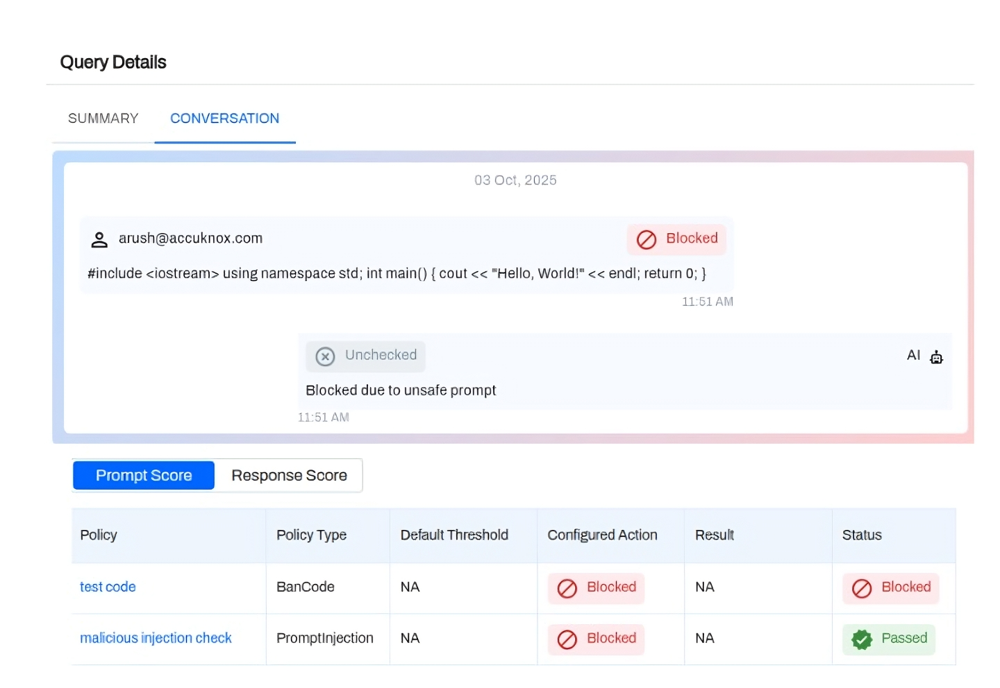
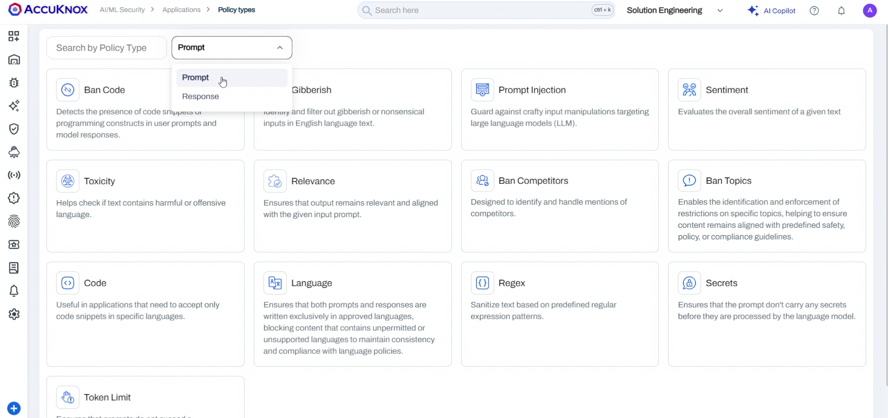
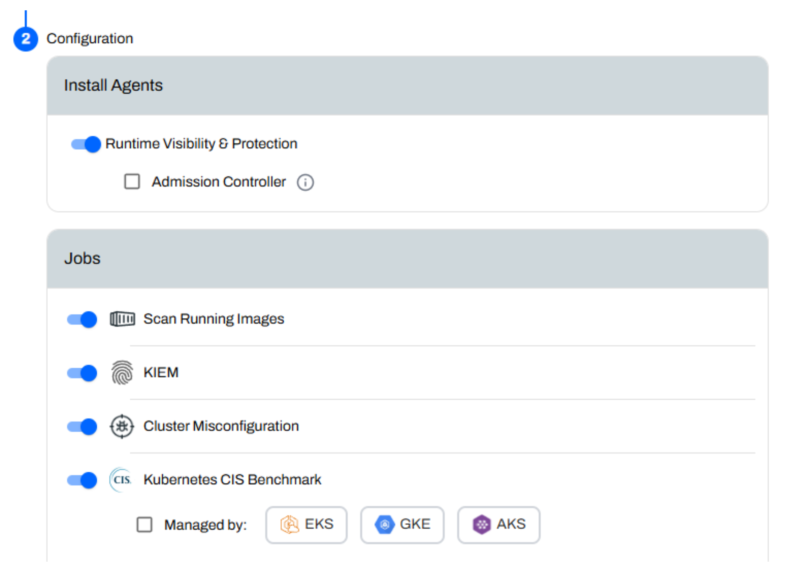
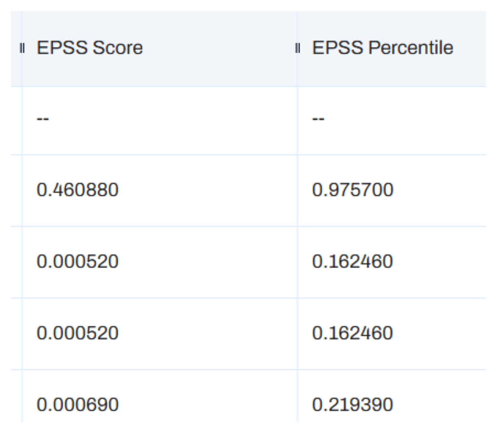
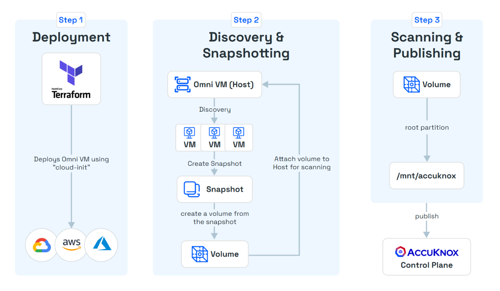
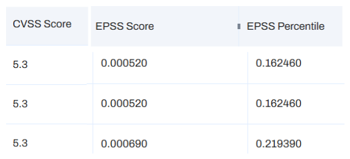

# AccuKnox v3.3 Release Notes

AccuKnox v3.3 expands the platform's depth with a focus on operational efficiency and extended coverage.

- This release moves beyond snapshot visibility by introducing 30-day historical trend data across all dashboards.
- We have improved our API Security offering with native AWS API Gateway integration and introduced authenticated DAST scanning to ensure protected endpoints are fully tested.
- Workflows are now faster with Unified Onboarding for image scanning and a new Batch Ask AI feature that allows teams to remediate findings in bulk.
- Experience improved data management with a centralized File Manager for exports and expanded our ecosystem support to include OCI, Red Hat OpenShift, and major SCA providers like GitHub and GitLab.

## API Security and AWS API Gateway Integration

We have expanded API Security capabilities to include AWS API Gateway support. Users can now enable log forwarding on existing API Gateway stages. A provided stack set connects logs to the discovery engine, creating a real-time inventory of API endpoints.

The system categorizes traffic into sensitive, external, and internal flows. Users can upload OpenAPI specifications directly or via scan to compare actual traffic against defined specs. This comparison highlights Shadow APIs, Orphan APIs, and Active APIs. Findings include request/response details and sensitive data exposure.

## Authenticated DAST Scans

Dynamic Application Security Testing (DAST) now supports authenticated scans. Users can toggle between authenticated and unauthenticated modes. The system supports username and password inputs and visualizes the scan state with "Logged In," "Logged Out," and "Fallback" indicators.

This prevents false negatives where crawlers fail to access protected content. Users define specific text strings that appear on logged-in pages. This allows the scanner to verify authentication success.

## Rapid and Lightweight OnPrem Onboarding

We have optimized the on-premises installation process for the AccuKnox Control Plane with v3.3. Key improvements include:

- **Single node installation** of complete AccuKnox Control Plane (full CNAPP + ASPM + API Security + AI Security + KSPM).Previously, the resource requirements were atleast 3 nodes.
- **AWS AMI available for AccuKnox Control Plane installation**. The full installation can now be completed in <20 mins.
- **For non-AWS, a package installer is available**. The installation typically takes an hour for this.

**See Onboarding Guide:** [OnPrem Installation](https://help.accuknox.com/getting-started/on-prem-installation-guide/).

## Prompt Firewall Policies and Rules

LLM Prompt Firewall now inspects inputs and outputs to block injections, jailbreaks, and toxic content in real time based on the set prompt policies in the applications. This layer sits before your model to prevent data leaks. It stops unauthorized access and malicious inputs to enforce compliance with NIST and EU AI Act standards.

**See Onboarding Steps:** [Onboard Prompt Firewall App](https://help.accuknox.com/use-cases/llm-defense-app-onboard/).

**Read Detailed Blog:** [Protecting LLMs with AccuKnox's Prompt Firewall](https://accuknox.com/blog/llm-prompt-firewall-accuknox).

## SBOM (Phase I) - Version Comparison Utility

We added a comparison utility for Software Bill of Materials (SBOM). Users can upload CycloneDX JSON files into a project and select two versions to compare.

The interface highlights added packages, removed packages, and version changes between the two files. This aids in tracking dependency drift and supply chain changes over time.

## Simplified In-Cluster Image Scanning Onboarding

In-cluster image scanning is now integrated directly into the onboarding flow. Previously, this required separate agents and manual commands.

For Kubernetes, the onboarding Helm command now includes a toggle to enable image scanning immediately. For VMs, scanning remains command-based but feeds into the unified control plane.

**In-cluster Image Scanning allows deep, real-time scans of container images inside Kubernetes clusters, eliminating pre-deployment delays.**

**For detailed instructions, refer to**: [In-Cluster Image Scanning Onboarding](https://help.accuknox.com/how-to/in-cluster-image-scan-helm/).

## VM Findings Widgets

We also added 8 new VM-related widgets to the configurable dashboard library for better visualization of virtual machine vulnerabilities.

- Shows severity trends for Linux VM and malware findings so teams can spot spikes fast.
- Lists total findings by severity to guide clear remediation priorities.
- Surfaces the most common malware signatures across VMs for quicker investigation.
- Highlights the top VMs with high finding counts so teams know where to focus first.
- Reduces time spent correlating data by giving a single view of VM risk posture.

## File Manager and Export Options

Exports are no longer restricted to email delivery. A new File Manager section acts as a central download hub.

When generating reports for Assets, Findings, CSPM, or ASPM, users can choose delivery via Email, File Manager, or both. The File Manager auto-tags exports by product line and creates clear naming conventions for easy retrieval.

## Batch Ask AI Remediation

The "Ask AI" remediation feature now supports batch operations. Users can group multiple findings or assets and request remediation guidance for the entire set at once. This removes the need to trigger AI assistance individually for related alerts.

## Smart Tickets

Ticket creation for grouped findings now follows an Epic-like structure. When a user generates a ticket from a finding group, the system creates a parent ticket for the group context and individual child tickets for specific findings.

## Token Expiry Notifications

We implemented proactive alerts for token management. API and artifact tokens now trigger email notifications at 5 days, 3 days, and 1 day prior to expiration. A final alert is sent post-expiry.

## SCA (Software Composition Analysis) Findings

We added support for GitHub, GitLab, and Bitbucket. Users can connect public or private repositories and **select specific branches or tags for scanning**. Findings are reported under Software Composition Analysis (SCA). EPSS scores are calculated and stored in AccuKnox's internal VMDB and shown as columnar values for Software Composition Analysis findings.

## OCI Support

Oracle Cloud Infrastructure (OCI) is now supported for compliance scanning and asset visibility. After onboarding, view findings under Issues → Cloud Findings → Cloud Scan by selecting your Oracle account. OCI-specific widgets are available on the Dashboard, and compliance benchmarks can be managed in the Compliance section.

**Read the detailed docs:** [Oracle Cloud Infrastructure (OCI) Integration](https://help.accuknox.com/how-to/oracle-onboarding/).

## VM Scans Across Environments

**AccuKnox supports three onboarding channels for VM scanning: public cloud, OpenShift, and on-premise or unsupported platforms.** All three paths provide a similar onboarding flow, including token creation, basic config options, and malware-scanning instructions when needed.

!!! info "Note"
    "Malware" is now a distinct data type separate from general vulnerabilities. This classification includes OS-type context (Windows or Linux) to help prioritize threats specifically related to malicious software presence.

### Public Cloud (AWS, GCP, Azure)
Uses a Terraform-based onboarding flow where customers download a small Terraform bundle, fill in required variables, and run terraform apply to provision the scanner VM in their account.

### Private Cloud (RedHat OpenShift)
Customers deploy the AccuKnox Operator directly from the OpenShift console. Air-gapped clusters use special images provided for offline environments.

- We now support deploying the AccuKnox VM scanning tool through an OpenShift Operator. Users will soon be able to install it directly from OperatorHub using the OpenShift Software Catalog. Until it is listed, customers can use the Helm chart to install the operator, please contact `support@accuknox.com` for assistance.

### Agent-Based
For ESXi or other environments without agentless support, customers install a lightweight VM agent using a single curl command on each VM.

 We support airgapped installation as well.

## AccuKnox Vulnerability Database Enrichment

- AccuKnox now maintains an internal Vulnerability DB that enriches Trivy-based findings with additional context. This database stores calculated EPSS (Exploit Prediction Scoring System) scores and percentiles for known CVEs.
- This enrichment is currently available for Trivy-based data types including container images and Software Composition Analysis (SCA) findings.
- AccuKnox pulls enrichment data from the Vulnerability DB and displays it as additional columns in the findings view. This includes EPSS score and EPSS percentile alongside the standard CVSS score provided by Trivy. **This is designed to give users better insight into the likelihood of exploitation for each vulnerability than just a simple CVSS score alone**.

For details on Threat Intelligence Sources refer to: [AccuKnox Vulnerability Database](https://help.accuknox.com/resources/vulnerability-database/).

## Save-as-Filter in Findings

Users can now save custom filter configurations directly on the Findings page. These filters persist and apply across different finding categories. This allows users to quickly return to specific views without rebuilding complex query logic.

## Audit Trail Logs (EventTrail)

A functional audit log is now available. It tracks creation, access, and updates to system items. This provides necessary visibility for governance, compliance, and troubleshooting user actions.

**Check the detailed docs**: [Audit Trail Logs (EventTrail)](https://help.accuknox.com/getting-started/audit-trail-logs/).

## Takeaways

This release represents a significant step forward in operational flexibility and coverage. By integrating expanded OCI support, generic OpenShift scanning, and centralized file management, v3.3 empowers teams to manage diverse environments with precision. These updates are now live and available in your AccuKnox dashboard.
