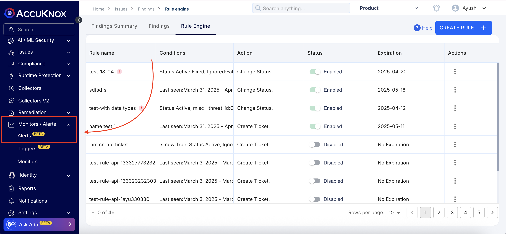
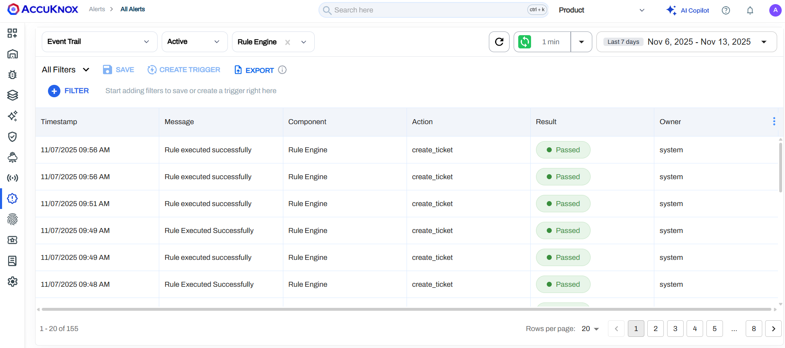
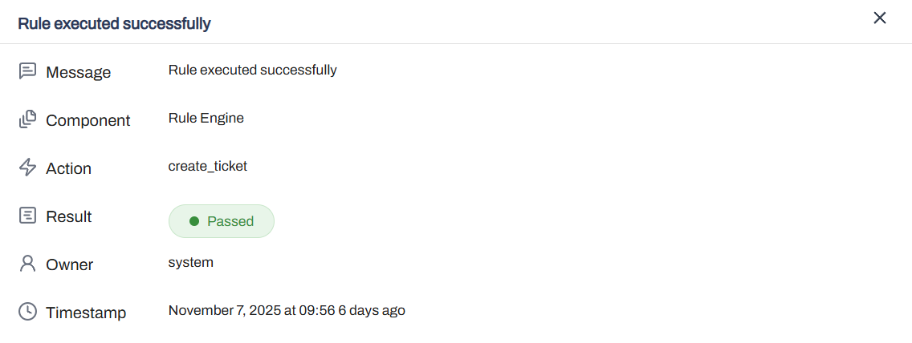
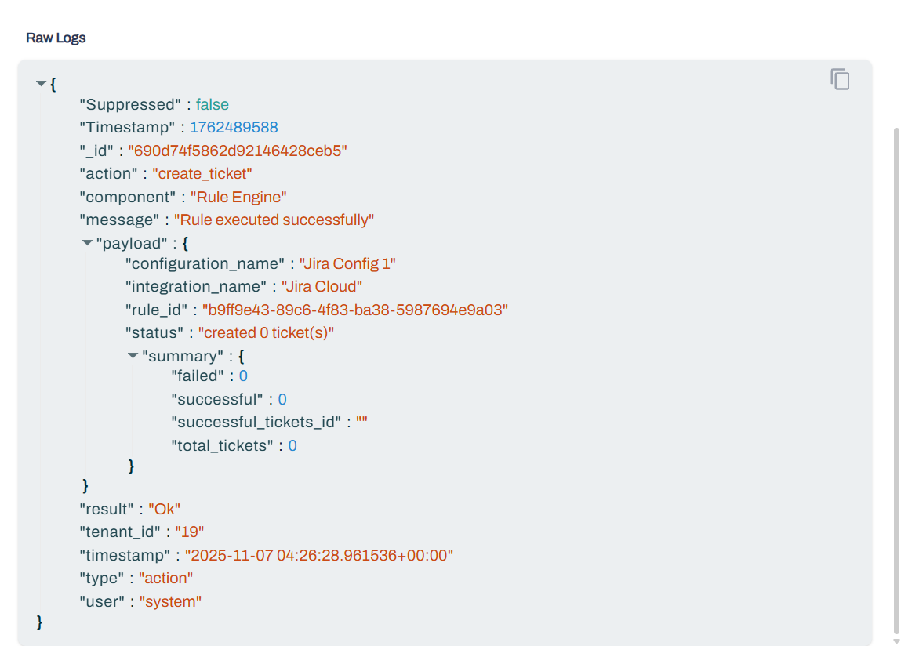

# Alert Audit Trail

This page explains what EventTrail is, the problem it solves, example log formats, and how to use the UI step by step.

EventTrail is a single, centralized view of all internal actions by users and system automation. It records **what happened, who triggered it, when it happened, whether it succeeded or failed, and structured details** for each event.

By consolidating entries, EventTrail eliminates blind spots — for example, **ticket-creation failures in the Rule Engine**, unclear user-invite activity, and missing timelines for finding-status changes — making those events discoverable and auditable.

Benefits include **faster debugging** of integrations and rules; **clear traceability** of user and automated actions; **support for audits and incident reports**; powerful **filtering** by component, action, user, result, or time; and a **Raw JSON view** for field-level investigation.

!!! note
    This feature is available at: https://app.accuknox.com/monitors-alerts/alerts

## Filters & search

EventTrail lets you narrow results using the main filters: **Component**, **Action**, **Result** (Ok/Fail/Warn), **User**, and **Date range**. Combine filters and use a payload text search to find specific fields (for example an email or ticket ID).

**Quick investigations**

- **Failed Jira ticket creation:** Component = **Rule Engine**, Action = **create_ticket**, Result = **Fail**.
- **Who invited a user:** Component = **User Management**, Action = **user_invited**, then search the payload for the invited email.
- **Audit timeline:** pick a date range and **export** the filtered logs.

## Personas & use cases

- **Platform Administrator:** check who invited users, verify role changes, and troubleshoot failed invites.
- **Security Engineer:** trace rule executions, confirm which automation changed a finding, and review integration failures over time.
- **Viewer / Auditor:** review logs for incidents and verify timing of system actions.

## Log Structure

Every entry uses a common schema:

```json
{
  "id": "uuid",
  "timestamp": "date-time",
  "tenant_id": "19",
  "component": "Rule Engine",
  "type": "action",
  "action": "create_ticket",
  "user": "system",
  "result": "Ok",
  "message": "Rule executed successfully",
  "payload": { ... }
}
```

### Field summary

| Field | Description |
| --- | --- |
| `component` | Source module. Examples: `Rule Engine`, `User Management`, `Vulnerability Management`. |
| `action` | The specific operation. Examples: `create_ticket`, `user_invited`, `findings-status-updated`. |
| `result` | `Ok`, `Fail`, or `Warn`. |
| `payload` | Structured details specific to the action. |

## Examples

### Ticket creation summary

```json
{
  "rule_id": "rule-123",
  "triggered_on": "2025-11-07T09:56:28Z",
  "configuration_name": "Jira Config 1",
  "integration_name": "Jira Cloud",
  "status": "created 3 ticket(s)",
  "summary": {
    "total_tickets": 3,
    "successful": 2,
    "successful_tickets_id": ["JIRA-1001", "JIRA-1002"],
    "failed": 1
  }
}
```

### Ticket creation failure (individual)

```json
{
  "ticket_id": null,
  "finding_id": "finding-def",
  "error": "Jira API rate-limited the request"
}
```

### Notification dispatch (Slack)

```json
{
  "rule_id": "rule-27",
  "triggered_on": "2025-11-07T09:50:00Z",
  "integration_name": "Slack",
  "channel_id": "slack-001",
  "status": "sent 18 notifications",
  "summary": {
    "total": 18,
    "successful": 15,
    "failed": 3
  }
}
```

### User invited

```json
{
  "invited_user": "ravi@accuknox.com",
  "role_assigned": "Viewer",
  "invite_status": "sent"
}
```

### Finding status changed

```json
{
  "finding_id": "00033f1f-8f30-45aa",
  "name": "linux-libc-dev: CVE-2024-57950",
  "data_type": "cx_containers",
  "previous_status": "Fixed",
  "new_status": "Active"
}
```

## EventTrail Filtering in AccuKnox

### 1. Navigate to EventTrail



1. Go to **Monitors → Alerts**.
2. In the event dropdown, select **EventTrail**.
3. The main table loads.



### 2. Main Table Fields

| Column | Meaning |
| | -- |
| Timestamp | When the action happened |
| Component | Source module |
| Action | Operation name |
| Result | Ok, Fail, Warn |
| User | Actor (`system` = automation) |
| Message | Human-readable summary |

Click any row to open the detail modal.

### 3. Detail View

Shows message, component, action, result, owner, and timestamp.



### 4. Raw Logs

Open **Raw Logs** to view or copy the full JSON entry.



The raw payload is the most useful place to diagnose integration failures or track exact field-level updates.
