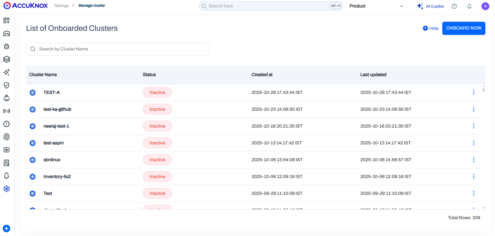
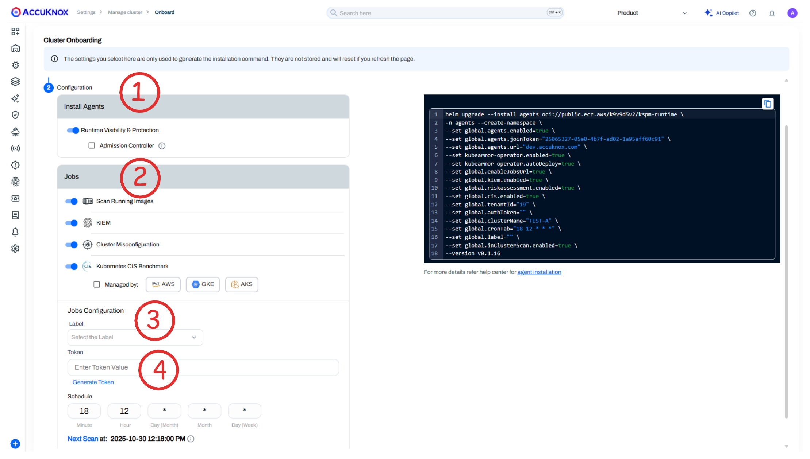

# Onboard Cluster for Misconfiguration Scanning
This guide outlines the steps for onboarding a cluster to AccuKnox SaaS for scanning cluster misconfigurations.

**Step 1:** For onboarding a cluster and for scanning for misconfigurations you need to create a token first. For creating follow these steps:

Go to `Settings > Tokens` and click on the create button.
Give your token a name and click on generate button.


**Step 2:** Once the token is generated, copy it and take a note of it.


**Step 3:** Now go to `Settings > Manage Clusters`, click on onboard now button or select an existing cluster.



**Step 4:** Give your cluster a name. Under the Jobs section **select Cluster Misconfiguration**. Select a label and paste your token. You can also change the schedule as per your requirement. Then next scan will happen based on the schedule. Scroll down and copy the helm command and run it inside a terminal. Then click on Finish button.



**Step 5:** Here's an example of how the command might look after selecting the Cluster Misconfiguration job. **Note that this is just an example; your actual command may vary based on your selections and join tokens so please copy it directly from the UI**:

```sh
helm upgrade --install agents oci://public.ecr.aws/k9v9d5v2/kspm-runtime \
-n agents --create-namespace \
--set global.agents.enabled=true \
--set global.agents.joinToken="c83c2242-a957-4794-aac0-9c1c947dfd56" \
--set global.agents.url="dev.accuknox.com" \
--set kubearmor-operator.enabled=true \
--set kubearmor-operator.autoDeploy=true \
--set global.tenantId="19" \
--set global.authToken="" \
--set global.clusterName="TEST-B" \
--set global.cronTab="08 19 * * *" \
--set global.label="" \                         // Needed for any job to select specific workloads
--set global.riskassessment.enabled=true \      // Enable Risk Assessment job
--version v0.1.16
```

**Step 6:** Once the scan is completed you can see the results on the findings page.

**Step 7:**
1. Go to the `Issues > Findings` page.

2. Select the Cluster Finding from the drop down.


**Step 8:** Click on any of the findings to see more details.


