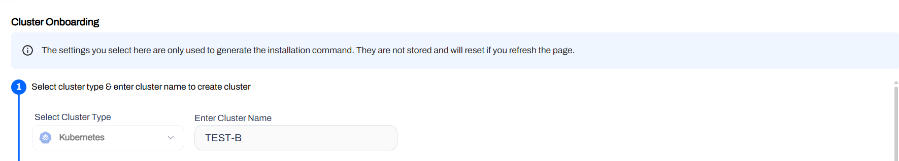
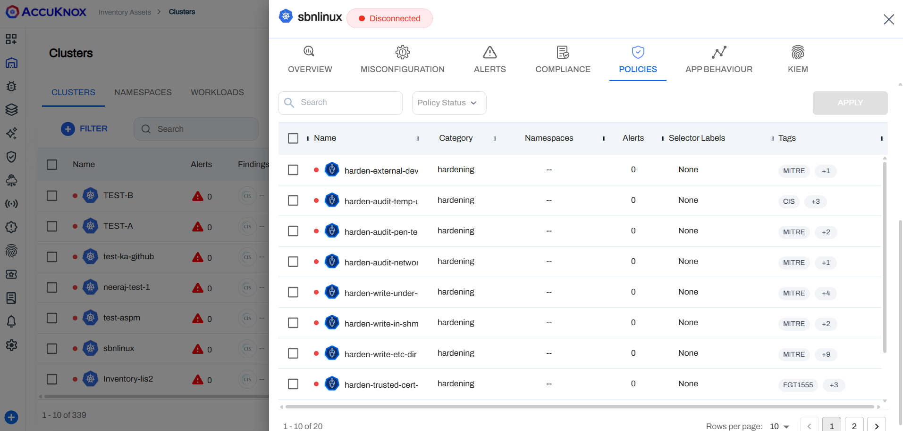

# Cluster Onboarding

This is a detailed guide on how to onboard clusters to the AccuKnox SaaS platform. The guide covers the installation of KubeArmor and AccuKnox agents in the cluster to connect to the AccuKnox SaaS application.

## Go To Manage Clusters

**Step 1**: Navigate to Manage Cluster from Settings Tab: From this page we can onboard the clusters running in various cloud platforms like GCP, AWS and Azure. We can onboard locally setup clusters using an cloud option. To onboard cluster select onboard now option


**Step 2**: In this screen, give any name to the cluster that you are going to onboard now.




## Install Necessary Agents in the Cluster via Toggles

**Step 3**: Installing AccuKnox agents

We will install AccuKnox agents to connect the cluster to the AccuKnox SaaS. For agent installation, select "Runtime Visibility & Protection".

1. **KubeArmor** — runtime enforcement (see above); enforces policies dynamically via LSMs.
2. **Feeder Service** — collects KubeArmor feeds and forwards them to the AccuKnox backend.
3. **Shared Informer Agent** — gathers cluster metadata (pods, nodes, namespaces, etc.).
4. **Policy Discovery Engine** — discovers policies by analyzing workload and cluster information provided by the Shared Informer.


From the UI, you can select the items that you want. Based on the toggles selected by the user, the command on to execute on the right side will change accordingly and can be copied and executed in the cluster.


1. Runtime Visibility & Protection is selected and the command to install the AccuKnox agents is shown on the right side.
2. Depending on which toggles you turn on for jobs the command will change accordingly.:
    - In-cluster ./images/cluster-onboarding/image scanning job.
    - KIEM toggle allows Kubernetes Identity and Entitlement Management job.
    - Cluster Misconfiguration Assessment via the Cluster Misconfiguration toggle.
    - CIS Benchmarking job, and further if you have GKE cluster you can select the platform as GKE.
3. Labels are mandatory if any of the jobs are selected to run on specific workloads.
4. Tokens are optional and can be generated from the Tokens section.

AccuKnox Agents can be installed using the following command as generated from the UI:

```sh
helm upgrade --install agents oci://public.ecr.aws/k9v9d5v2/kspm-runtime \
-n agents --create-namespace \
--set global.agents.enabled=true \
--set global.agents.joinToken="c83c2242-a957-4794-aac0-9c1c947dfd56" \
--set global.agents.url="dev.accuknox.com" \
--set kubearmor-operator.enabled=true \
--set kubearmor-operator.autoDeploy=true \
--version v0.1.16
```

!!! info "Note"
    **Always copy the latest command from the UI as the command may change based on the toggles selected.**
    In the above command, the following parameters are optional and depends on which jobs the user wants to enable:
    ```sh
    --set global.tenantId="19" \
    --set global.authToken="" \
    --set global.clusterName="TEST-B" \
    --set global.cronTab="08 19 * * *" \
    --set global.label="" \                         // Needed for any job to select specific workloads
    --set global.inClusterScan.enabled=true \       // Enable In-Cluster Scan job
    --set global.kiem.enabled=true \                // Enable KIEM job
    --set global.riskassessment.enabled=true \      // Enable Risk Assessment job
    --set global.cis.enabled=true \                 // Enable CIS Benchmark job
    --set global.cis.toolConfig.platform="GKE" \    // Specify platform for CIS
    ```
    In the above command joinToken is specific to this example and it will vary based on the cluster being onboarded.


## View Onboarded Clusters

**Step 4:** Onboarded Cluster

After installing all the AccuKnox agents the cluster is onboarded successfully into the SaaS application. We can see the workload details of the onboarded cluster by Navigating to Inventory→cloud Workloads option. There all the onboarded clusters will be listed out and all the inactive ones would be grayed out. By Double clicking on the active cluster user can get a more detailed view of the cluster.



  - - -
[SCHEDULE DEMO](https://www.accuknox.com/contact-us){ .md-button .md-button--primary }
