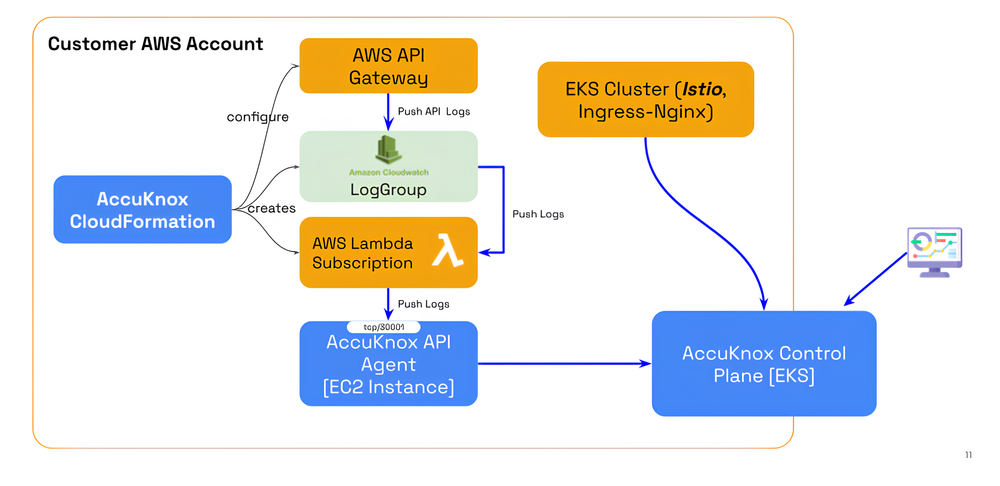
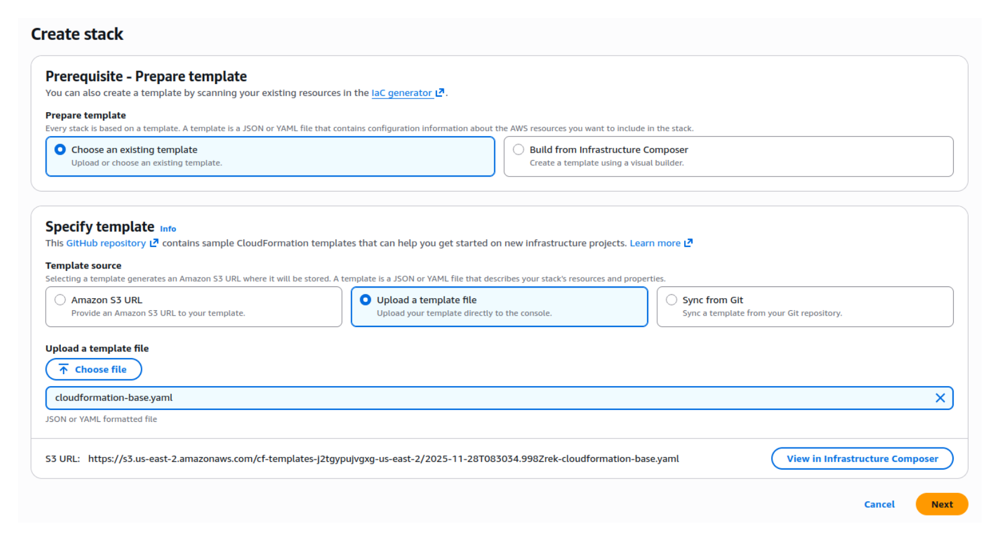
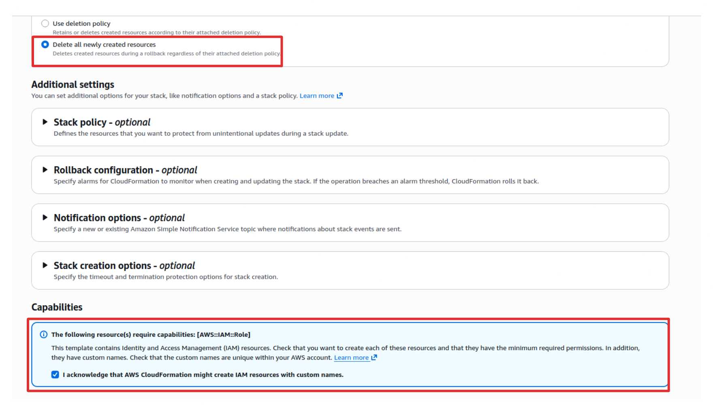
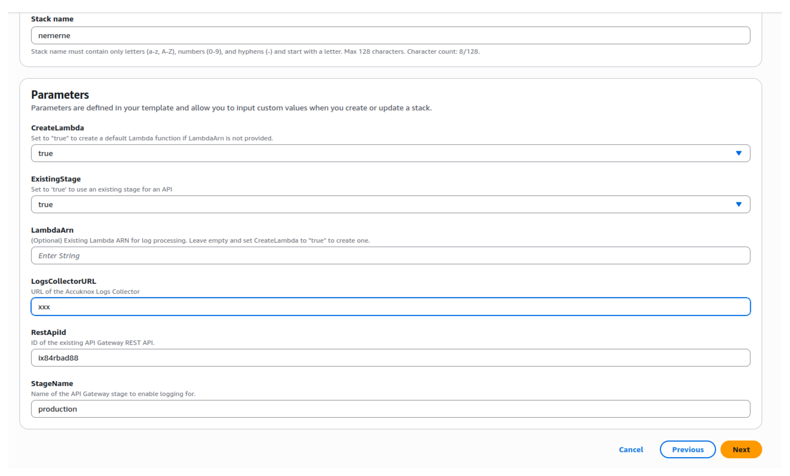
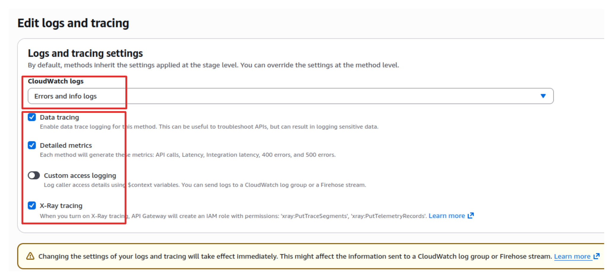

# AWS API Gateway Integration

This guide provides the steps required to connect AWS API Gateway to AccuKnox Control Plane for API Security.

!!! info "Quick Rundown of Steps"
    - Deploy the AccuKnox CloudFormation templates in your AWS account.
    - Enable logging for your API Gateway stages.
    - Configure permissions for the Lambda function to forward logs.

## 1. Deploy the AccuKnox CloudFormation Template

The deployment process requires running two specific CloudFormation stacks in sequence.

### Stack 1: Base Stack

⬇️ [**DOWNLOAD CLOUDFORMATION BASE TEMPLATE**](./cloudformation-base.yaml)

The base stack creates the necessary IAM role and permissions required for the integration.

1. Download the base stack template above.
2. In your AWS account, open **CloudFormation → Create Stack** and upload the template.
3. Select "**Delete all newly created resources**" to ensure clean reversion if needed.
4. Launch the stack.

### Stack 2: Standard CloudFormation Stack

⬇️ [**DOWNLOAD CLOUDFORMATION TEMPLATE**](./cloudformation.yaml)

This stack must be run once for each deployment stage (e.g., Dev, Staging, Prod).

1. Download the standard CloudFormation template above.
2. In your AWS account, open **CloudFormation → Create Stack** and upload the template.
3. Configure the following parameters:

| Option             | Typical Value / Notes                                      |
|-----------------------|------------------------------------------------------------|
| **Create Lambda**     | `True` (first run), `False` (subsequent runs)              |
| **ExistingStage**     | `True` (99% of cases when API is deployed and working)     |
| **Log Collection URL**| (Provide your log collector endpoint)                      |
| **REST API ID**       | (Copy from AWS API Gateway)                                |
| **Stage Name**        | `dev`, `stage`, `prod`, etc.                               |

Launch the stack so it creates:

- A **CloudWatch Log Group** for API Gateway logs.
- A **Lambda subscription function** to forward logs to the AccuKnox API Agent.

## 2. Enable Logging in AWS API Gateway

1. Navigate to **API Gateway → Stages → [Select Stage]**.
2. Click on **Logs/Tracing**.
3. Click **Edit**.
4. Enable the following settings as shown in the image below.
5. Click **Save changes**.

Once enabled, API Gateway begins writing API request and response logs to CloudWatch.

**At this point , your AWS API Gateway is integrated with AccuKnox API Security.** Logs will be forwarded to the AccuKnox Control Plane for analysis and endpoints will start appearing in the API Inventory.

!!! tip "**Next Steps**"
    Proceed to the [**API Security Use Case**](../use-cases/api-security.md) to learn how to view your API inventory, create collections, upload OpenAPI specifications, and scan for security findings.
