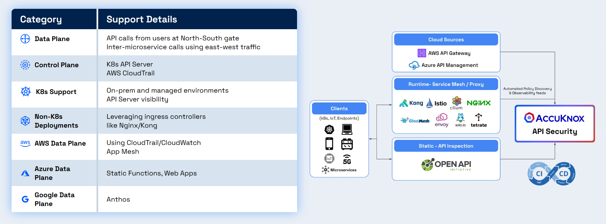

# API Security Integrations

The **API Security** module provides deep visibility and continuous risk assessment for your APIs by analyzing live traffic, identifying unknown endpoints, and highlighting security exposures.

::cards:: cols=3

- title: AWS API Gateway
  image: ./aws-api-gateway.png
  url: ../integrations/api-aws.md
  description: Monitor and secure APIs running on AWS API Gateway

- title: K8s API Security Proxy
  image: ./k8s.png
  url: ../integrations/api-k8s.md
  description: Secure APIs in Kubernetes environments

- title: Istio
  image: ./istio.png
  url: ../integrations/api-istio.md
  description: Integrate with Istio service mesh for API security

- title: Nginx Ingress
  image: ./image-13.png
  url: ../integrations/api-nginx.md
  description: Protect APIs exposed via Nginx Ingress Controller

- title: Nginx Server
  image: ./nginx.png
  url:
  description: Secure APIs served by Nginx web server

- title: Azure API Management
  image: ./image-12.png
  url:
  description: Monitor APIs managed through Azure API Management

::/cards::

## Key Capabilities

- **Real-Time Inventory**: Automatically discovers APIs from traffic with risk scoring based on authentication, exposure, and sensitive data
- **Risk Detection**: Identifies Shadow, Zombie, and Orphan APIs through continuous traffic analysis
- **Logical Grouping**: Organize APIs for efficient tracking and management

!!! tip "**Use Cases**"
    Proceed to the [API Security Use Case](../use-cases/api-security.md) to learn how to view your API inventory, create collections, upload OpenAPI specifications, and scan for security findings.

