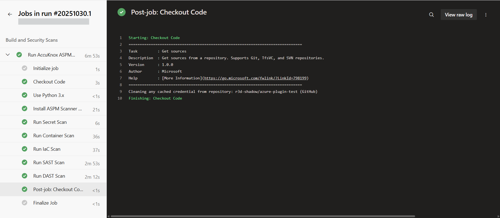
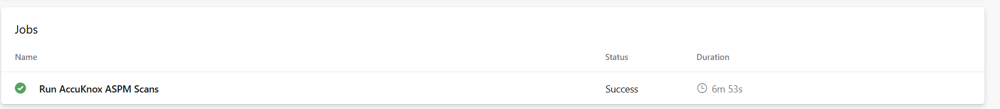
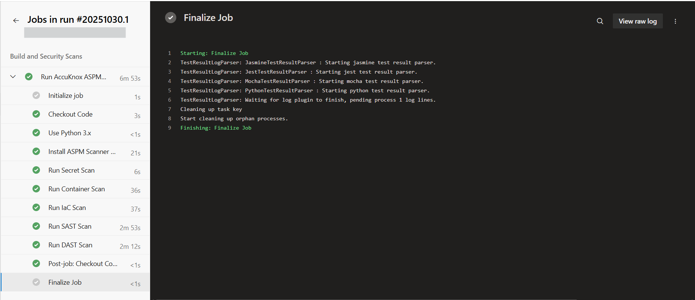
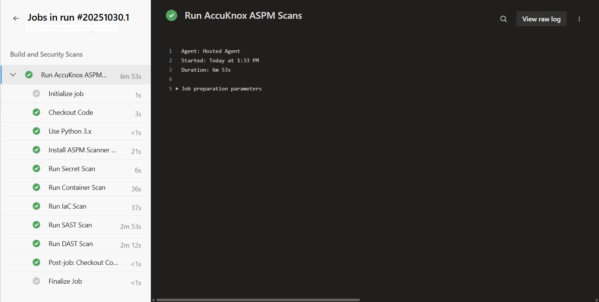
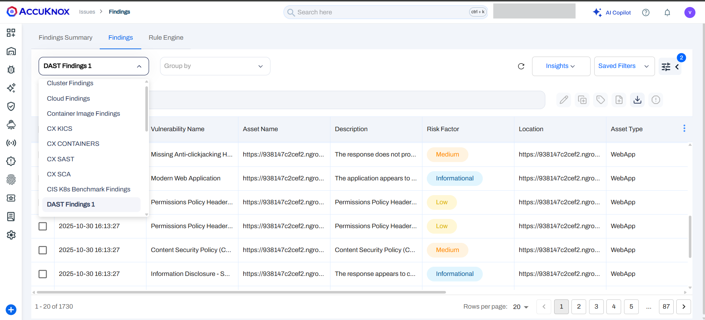
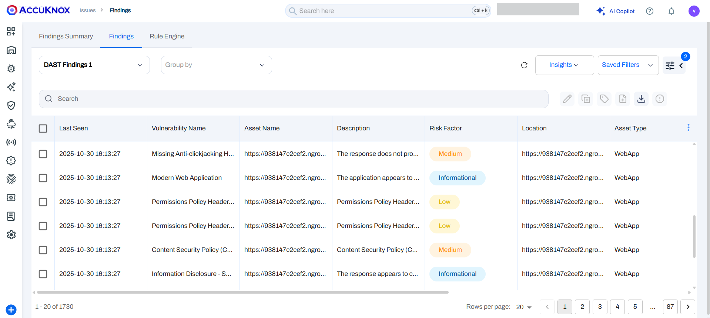
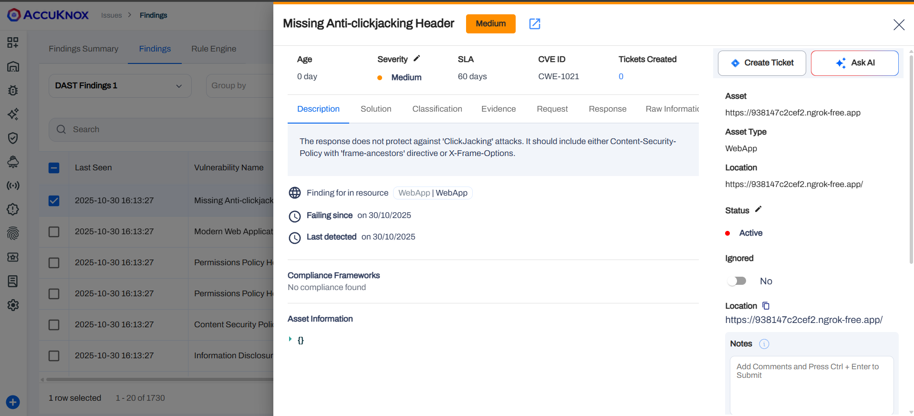

# Azure DevOps pipeline — AccuKnox ASPM Scanner

This workflow runs AccuKnox ASPM scans inside an Azure DevOps pipeline. It supports:

- Secret scanning
- Container scanning
- Infrastructure-as-Code (IaC) scanning
- Static Application Security Testing (SAST)
- Dynamic Application Security Testing (DAST)

!!! info
    Comment out or remove any scan steps you don't need to reduce execution time.

## Prerequisites

Ensure the build agent/VM has:

- Docker
- Python 3 and pip

## Pipeline YAML

Create `azure-pipelines.yml` at the repository root and paste the following:

```yaml
trigger:
  - main

pool:
  vmImage: 'ubuntu-latest'

variables:
  ACCUKNOX_ENDPOINT: #Accuknox-endpoint (e.g., cspm.demo.accuknox.com).
  ACCUKNOX_LABEL: '#your-accuknox-label'
  ACCUKNOX_TOKEN: #your-accuknox-token

stages:
- stage: BuildAndScan
  displayName: 'Build and Security Scans'
  jobs:
  - job: RunAccuKnoxScans
    displayName: 'Run AccuKnox ASPM Scans'
    steps:
    - checkout: self
      displayName: 'Checkout Code'

    - task: UsePythonVersion@0
      displayName: 'Use Python 3.x'
      inputs:
        versionSpec: '3.x'
        addToPath: true

    - script: |
        set -e
        python3 -m pip install --user \
          https://github.com/accuknox/aspm-scanner-cli/releases/download/v0.13.4/accuknox_aspm_scanner-0.13.4-py3-none-any.whl --break-system-packages
      displayName: 'Install ASPM Scanner CLI'

    - script: |
        softFailArg=""
        if [ "$SOFT_FAIL" == "true" ]; then
          softFailArg="--softfail"
        fi

        command="git file://."
        args=""
        if [ -n "$RESULTS" ]; then args+=" --results $RESULTS"; fi
        if [ -n "$BRANCH" ]; then args+=" --branch $BRANCH"; fi
        if [ -n "$EXCLUDE_PATHS" ]; then args+=" --exclude-paths '$EXCLUDE_PATHS'"; fi

        fullCmd="$HOME/.local/bin/accuknox-aspm-scanner scan ${softFailArg} secret --command \"${command}${args}\" --container-mode"
        echo "Running: ${fullCmd}"
        eval "${fullCmd}"
      displayName: 'Run Secret Scan'
      env:
        DISABLE_SPINNER: "TRUE"
        RESULTS: ""
        BRANCH: "all"
        EXCLUDE_PATHS: ""
        SOFT_FAIL: "true"

    - script: |
        softFailArg=""
        if [ "$SOFT_FAIL" == "true" ]; then
          softFailArg="--softfail"
        fi

        echo "Building Docker image ${IMAGE}:${IMAGE_TAG}..."
        docker build -t ${IMAGE}:${IMAGE_TAG} -f Dockerfile .

        cmd="image ${IMAGE}:${IMAGE_TAG}"
        if [ -n "$SEVERITY" ]; then cmd+=" --severity $SEVERITY"; fi

        fullCmd="$HOME/.local/bin/accuknox-aspm-scanner scan ${softFailArg} container --command \"${cmd}\" --container-mode"
        echo "Running: ${fullCmd}"
        eval "${fullCmd}"
      displayName: 'Run Container Scan'
      env:
        SOFT_FAIL: "true"
        IMAGE: "test"
        IMAGE_TAG: "latest"
        SEVERITY: "CRITICAL,HIGH,WARNING,MEDIUM,LOW,INFO"

    - script: |
        softFailArg=""
        if [ "$SOFT_FAIL" == "true" ]; then
          softFailArg="--softfail"
        fi

        cmdArgs=""
        if [ -n "$FILE" ]; then cmdArgs+=" --file $FILE"; fi
        if [ -n "$DIRECTORY" ]; then cmdArgs+=" --directory $DIRECTORY"; fi
        if [ "$COMPACT" == "true" ]; then cmdArgs+=" --compact"; fi
        if [ "$QUIET" == "true" ]; then cmdArgs+=" --quiet"; fi
        if [ -n "$FRAMEWORK" ]; then cmdArgs+=" --framework $FRAMEWORK"; fi

        fullCmd="$HOME/.local/bin/accuknox-aspm-scanner scan ${softFailArg} iac --command \"${cmdArgs}\" --container-mode"
        echo "Running: ${fullCmd}"
        eval "${fullCmd}"
      displayName: 'Run IaC Scan'
      env:
        SOFT_FAIL: "true"
        DIRECTORY: "."
        COMPACT: "true"
        QUIET: "true"
        FILE: ""
        FRAMEWORK: ""

    - script: |
        softFailArg=""
        if [ "$SOFT_FAIL" == "true" ]; then
          softFailArg="--softfail"
        fi

        command="scan ."
        fullCmd="$HOME/.local/bin/accuknox-aspm-scanner scan ${softFailArg} sast --command \"${command}\" --container-mode"

        echo "Running: ${fullCmd}"
        eval "${fullCmd}"
      displayName: 'Run SAST Scan'
      env:
        SOFT_FAIL: "true"

    - script: |
        softFailArg=""
        if [ "$SOFT_FAIL" == "true" ]; then
          softFailArg="--softfail"
        fi

        mkdir -p /tmp/scan-dir
        chmod 777 /tmp/scan-dir
        cd /tmp/scan-dir

        args="${DAST_SCAN_SCRIPT} -t ${TARGET_URL} -I"
        fullCmd="$HOME/.local/bin/accuknox-aspm-scanner scan ${softFailArg} dast --command \"${args}\" --container-mode --severity-threshold $SEVERITY_THRESHOLD"
        echo "Running: ${fullCmd}"
        eval "${fullCmd}"
        cd -
      displayName: 'Run DAST Scan'
      env:
        SOFT_FAIL: "true"
        TARGET_URL: "https://juice-shop.herokuapp.com/" #change this to actually endpoint
        DAST_SCAN_SCRIPT: "zap-baseline.py"
        SEVERITY_THRESHOLD: "High"
```

## Variables to update

Update the following pipeline variables before running:

- ACCUKNOX_ENDPOINT — URL of the AccuKnox CSPM panel (e.g., cspm.demo.accuknox.com).
- ACCUKNOX_TOKEN — Token for authenticating with AccuKnox. See [How to Create Tokens](https://help.accuknox.com/how-to/how-to-create-tokens/).
- ACCUKNOX_LABEL — Label used to categorize results. See [How to Create Labels](https://help.accuknox.com/how-to/how-to-create-labels).

!!! note
    Comment out or remove any scan modules that you don’t need.
    e.g, if you don't want to run DAST, you can comment out the DAST stages in the azure-pipelines.yml file. This helps reduce execution time and makes the pipeline faster and cleaner.

### Secret scan variables

| Parameter | Description | Example |
|---|---:|---|
| DISABLE_SPINNER | Disable animated progress output in CI logs | TRUE |
| RESULTS | File path to store raw scan results (optional) | results/secrets.json |
| BRANCH | Branches to scan (use "all" or branch name) | all |
| EXCLUDE_PATHS | Comma-separated paths to exclude | .git/, node_modules/, dist/ |
| SOFT_FAIL | Allow pipeline to continue if findings are detected | true |

### Container scan variables

| Parameter | Description | Example |
|---|---:|---|
| SOFT_FAIL | Allow pipeline to continue on findings | true |
| IMAGE | Docker image name built in pipeline | myapp |
| IMAGE_TAG | Image tag to scan | latest |
| SEVERITY | Comma-separated severity levels to include | CRITICAL,HIGH,MEDIUM |

IaC / SAST / DAST variables are configured inline in the YAML under each step (see the env block for defaults).

### IaC (Infrastructure as Code) scan variables

| Parameter | Description | Example |
|---|---:|---|
| SOFT_FAIL | Continue pipeline even if IaC misconfigurations are found. | true |
| DIRECTORY | Path to the folder containing IaC files (Terraform, CloudFormation, Kubernetes, etc.). | . |
| FILE | Specific IaC file to scan (optional). | main.tf |
| FRAMEWORK | Framework type to target (e.g., `terraform`, `cloudformation`, `kubernetes`). | terraform |
| COMPACT | Enables concise output for cleaner logs. | true |
| QUIET | Suppresses non-critical output in logs. | true |

### DAST (Dynamic Application Security Testing) variables

| Parameter | Description | Example |
|---|---:|---|
| SOFT_FAIL | Continue pipeline even if issues are found. | true |
| TARGET_URL | Web app endpoint to scan. | https://yourapp.example.com/ |
| DAST_SCAN_SCRIPT | Scan script to run (`zap-baseline.py` = quick, `zap-full-scan.py` = full). | zap-full-scan.py |
| SEVERITY_THRESHOLD | Fail pipeline if findings meet or exceed this severity. | High |

## Run the pipeline



- Commit the `azure-pipelines.yml` file.
- Trigger the pipeline manually or by pushing to the branch defined in `trigger:`.




- The pipeline installs the AccuKnox ASPM Scanner CLI.
    - Secret Scan — Detects exposed secrets or credentials.
    - Container Scan — Analyses Docker images for vulnerabilities.
    - IaC Scan — Reviews Infrastructure-as-Code for misconfigurations.
    - SAST Scan — Checks source code for security flaws.
    - DAST Scan — Performs dynamic application security testing on live targets.
- Scan results are sent to the AccuKnox CSPM dashboard for review, further risk analysis and remediation.



## View results in AccuKnox

1. Log in to your AccuKnox dashboard.
2. Navigate to Issues → Findings.



3. Select the Scan Type from the dropdown to view results.


## Conclusion
By following this guide, you’ve successfully integrated AccuKnox ASPM Scanning into your Azure DevOps CI/CD pipeline.

This setup enables automated security testing — including Secret Scans, Container Scans, IaC Checks, SAST, and DAST — every time your code is built or updated.

You can now continuously detect and remediate vulnerabilities early in the DevSecOps lifecycle

With this integration, your CI/CD workflow is not only automated but also security-aware, ensuring compliance and proactive protection for your applications.
