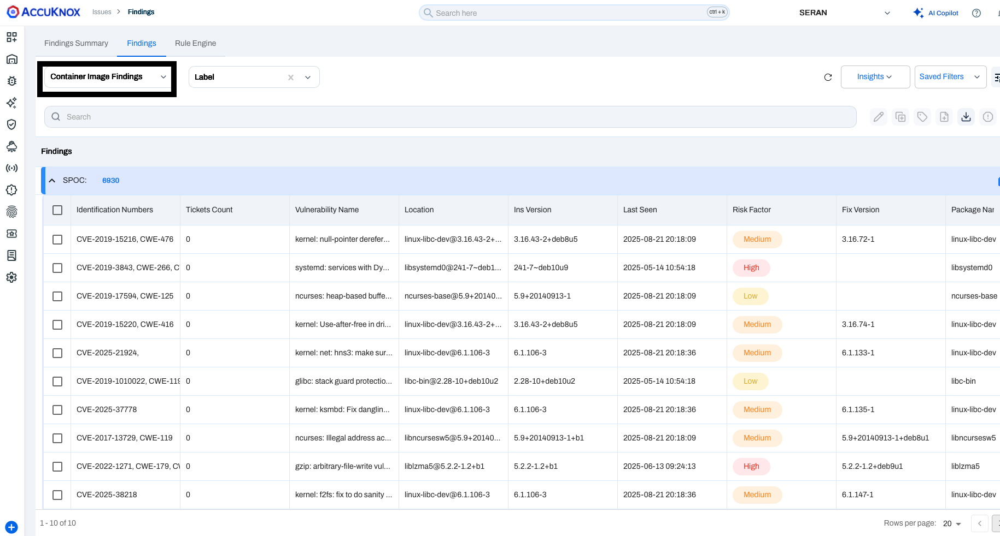
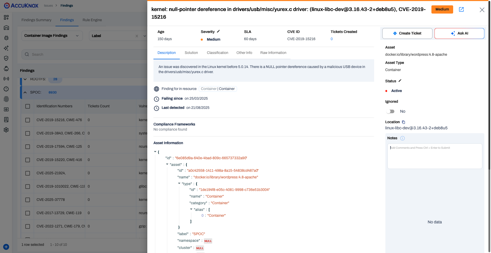

# Container Image Scan with Bamboo CI
Integrate AccuKnox Container Scanning with Bamboo CI to automate image vulnerability scans during builds and centralize findings for tracking and remediation.

## Prerequisites

!!! abstract "Before you begin"
    Ensure you have the following prerequisites ready before starting the integration:

    1. **Bamboo Access** - Permission to create and configure build plans, and manage global variables.
        - *Reference:* [Getting started with Bamboo | Bamboo Data Center 12.0](https://confluence.atlassian.com/bamboo/getting-started-with-bamboo-289277283.html)

    2. **AccuKnox UI Access** - Access to the AccuKnox platform.

    3. **AccuKnox Scan API Credentials** - You will need the following details:
        - Authentication Token - [How to Create Token](https://help.accuknox.com/how-to/how-to-create-tokens/)
        - Labels - [How to Create Labels](https://help.accuknox.com/how-to/how-to-create-labels/)
        - Endpoint URL

    4. **Repository Access** - Ensure Bamboo can perform a **full clone** of your source code repository during the build process.
        - *Reference:* [GitHub | Bamboo Data Center 10.2](https://confluence.atlassian.com/bamboo1020/github-1540728277.html)

    5. **Global Variables** - Defined global variables for endpoint, token, label, and softfail (including additional variables as required).
        - *Reference:* [Defining global variables | Bamboo Data Center 12.0](https://confluence.atlassian.com/bamboo/configuring-source-code-checkout-task-289277112.html)

---

## Configuration Steps

### Step 1: Define Global Variables

Navigate to **Bamboo Administration → Global Variables** and add the following:

| Variable Name | Description | Example |
| :--- | :--- | :--- |
| `ACCUKNOX_ENDPOINT` | URL of the AccuKnox CSPM panel | `cspm.demo.accuknox.com` |
| `ACCUKNOX_TOKEN` | Authentication token for AccuKnox API | `your_api_token_here` |
| `ACCUKNOX_LABEL` | Label to tag scan results | `bamboo-container` |
| `SOFT_FAIL` | Optional flag to allow pipeline continuation on failure | `true` |

### Step 2: Configure Container Scan Stage on Your Build Pipeline

Create or edit your existing pipeline to include steps that:

1. Builds your Docker image: `docker build -t $IMAGE:$IMAGE_TAG -f Dockerfile .`
2. Saves the image to a tarball: `docker save -o $IMAGE_TAR $IMAGE:$IMAGE_TAG`

!!! note "Note"
    Edit image tags, variables or names as per your requirement.

=== "Shell Script"

    ```bash title="Script Task"
    #!/bin/sh -e
    export SOFT_FAIL="true"
    export ACCUKNOX_ENDPOINT="${bamboo.ACCUKNOX_ENDPOINT}"
    export ACCUKNOX_TOKEN="${bamboo.ACCUKNOX_TOKEN}"
    export ACCUKNOX_LABEL="${bamboo.ACCUKNOX_LABEL}"
    export IMAGE="test"
    export IMAGE_TAG="latest"
    export SEVERITY="CRITICAL,HIGH,WARNING,MEDIUM,LOW,INFO"

    # ASPM Scanner Installation
    wget -q https://github.com/accuknox/aspm-scanner-cli/releases/download/v0.13.8/accuknox-aspm-scanner -O accuknox-aspm-scanner
    chmod +x accuknox-aspm-scanner

    # Determine soft-fail arg
    if [ "${SOFT_FAIL}" = "true" ]; then
        softFailArg="--softfail"
    else
        softFailArg=""
    fi

    echo "Building Docker image ${IMAGE}:${IMAGE_TAG}..."
    docker build -t "${IMAGE}:${IMAGE_TAG}" -f Dockerfile .

    cmd="image ${IMAGE}:${IMAGE_TAG}"
    if [ -n "${SEVERITY}" ]; then
        cmd="${cmd} --severity ${SEVERITY}"
    fi
    fullCmd="accuknox-aspm-scanner scan ${softFailArg} container --command \"${cmd}\" --container-mode"

    # Initiating Container Scan
    echo "Running: ${fullCmd}"
    eval ${fullCmd}
    ```

=== "YAML Configuration"

    ```yaml title="bamboo-specs.yaml"
    - script:
        interpreter: SHELL
        scripts:
          - |-
            #!/bin/sh -e
            export SOFT_FAIL="true"
            export ACCUKNOX_ENDPOINT="${bamboo.ACCUKNOX_ENDPOINT}"
            export ACCUKNOX_TOKEN="${bamboo.ACCUKNOX_TOKEN}"
            export ACCUKNOX_LABEL="${bamboo.ACCUKNOX_LABEL}"
            export IMAGE="test"
            export IMAGE_TAG="latest"
            export SEVERITY="CRITICAL,HIGH,WARNING,MEDIUM,LOW,INFO"

            # ASPM Scanner Installation
            wget -q https://github.com/accuknox/aspm-scanner-cli/releases/download/v0.13.8/accuknox-aspm-scanner -O accuknox-aspm-scanner
            chmod +x accuknox-aspm-scanner

            # Determine soft-fail arg
            if [ "${SOFT_FAIL}" = "true" ]; then
                softFailArg="--softfail"
            else
                softFailArg=""
            fi

            echo "Building Docker image ${IMAGE}:${IMAGE_TAG}..."
            docker build -t "${IMAGE}:${IMAGE_TAG}" -f Dockerfile .

            # Build the scanner command (shell style)
            cmd="image ${IMAGE}:${IMAGE_TAG}"
            if [ -n "${SEVERITY}" ]; then
                cmd="${cmd} --severity ${SEVERITY}"
            fi
            fullCmd="accuknox-aspm-scanner scan ${softFailArg} container --command \"${cmd}\" --container-mode"

            # Initiating Container Scan
            echo "Running: ${fullCmd}"
            eval ${fullCmd}
        description: container scan script
        artifact-subscriptions: []
    ```

!!! tip "Artifacts"
    Optionally collect the image tarball and any scanner output as build artifacts so they can be reviewed or downloaded from Bamboo. However, details of the same shall be available on the AccuKnox dashboard.

---

## Workflow Comparison

!!! failure "Workflow Execution Without AccuKnox"
    Vulnerable images may be pushed to registries and production without centralized tracking.

!!! success "Workflow Execution With AccuKnox"
    Integrating AccuKnox Container Scan with Bamboo CI ensures:

    - Every build can trigger a container scan and results are pushed to AccuKnox
    - Insecure builds can be blocked (if `SOFT_FAIL=false`)
    - Findings are centralized in the AccuKnox dashboard and can be used for ticketing and remediation

---

## Viewing Results in AccuKnox

1. After the pipeline run, log in to **AccuKnox**.

2. Navigate to **AccuKnox → Issues → Findings**, and select **Container Image Findings**.
    
    *Container Image Findings Dashboard - Filtered by Label 'SPOC'*

3. Click any finding to view more details.
    

4. Use the **Create Ticket** button to raise a ticket directly from the finding.

---

## Registry Scan for Images

To onboard container registries refer to the below documentations:

- [Azure Container Registry (ACR) Onboarding](https://help.accuknox.com/how-to/acr/)
- [Elastic Container Registry (ECR) Onboarding](https://help.accuknox.com/how-to/ecr/)
- [Google Artifact Registry (GAR) Onboarding](https://help.accuknox.com/how-to/gar/)
- [Harbor Registry Onboarding](https://help.accuknox.com/how-to/harbor/)

**Additional Registry guides are available on [Registry Overview](/how-to/registry-overview/)**

!!! question "Need Help?"
    [Let us know](https://www.accuknox.com/contact-us/) if you are seeking additional guidance in planning your cloud security program.
