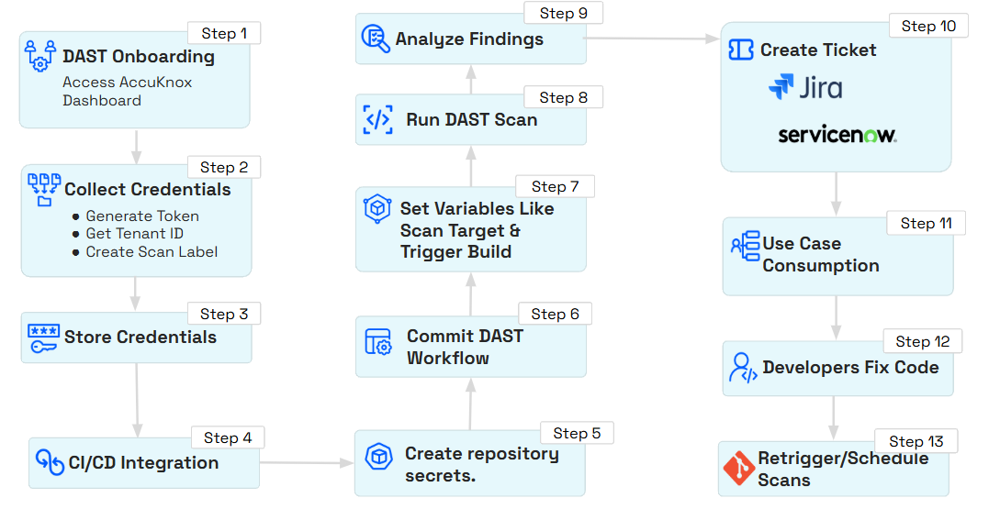
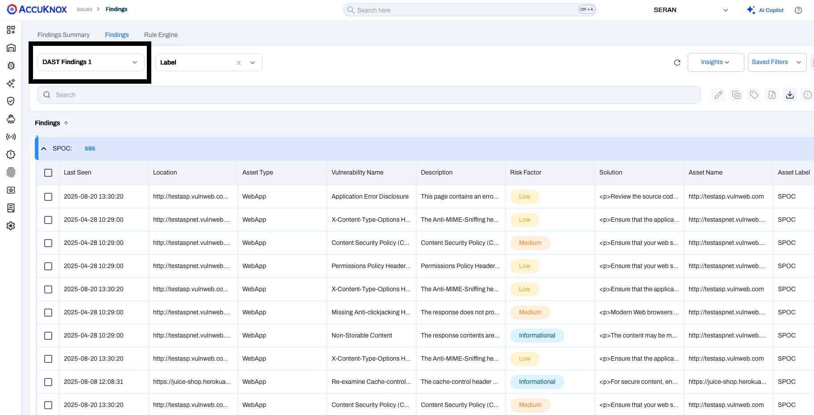
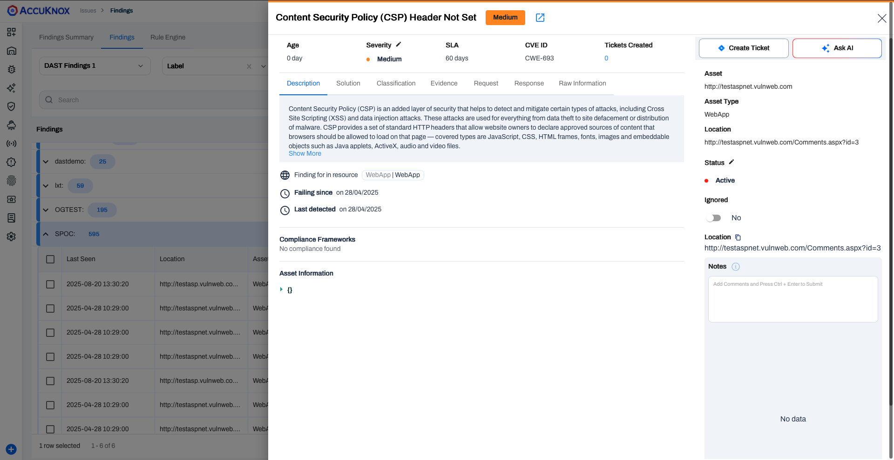

# DAST with Bamboo CI (Dynamic Application Security Testing)
Integrate AccuKnox DAST with Bamboo CI/CD to automate vulnerability scans for your web applications. Scan results are sent to AccuKnox CSPM for centralized visibility, compliance, and remediation.



## Prerequisites

!!! abstract "Before you begin"
    Ensure you have the following prerequisites ready before starting the integration:

    1. **Bamboo Access** - Permission to create and configure build plans, and manage global variables.
        - *Reference:* [Getting started with Bamboo | Bamboo Data Center 12.0](https://confluence.atlassian.com/bamboo/getting-started-with-bamboo-289277283.html)

    2. **AccuKnox UI Access** - Access to the AccuKnox platform.

    3. **AccuKnox Scan API Credentials** - You will need the following details:
        - Authentication Token - [How to Create Token](https://help.accuknox.com/how-to/how-to-create-tokens/)
        - Labels - [How to Create Labels](https://help.accuknox.com/how-to/how-to-create-labels/)
        - Endpoint URL

    4. **Repository Access** - Ensure Bamboo can perform a **full clone** of your source code repository during the build process.
        - *Reference:* [GitHub | Bamboo Data Center 10.2](https://confluence.atlassian.com/bamboo1020/github-1540728277.html)

    5. **Global Variables** - Defined global variables for endpoint, token, label, and softfail (including additional variables as required).
        - *Reference:* [Defining global variables | Bamboo Data Center 12.0](https://confluence.atlassian.com/bamboo/configuring-source-code-checkout-task-289277112.html)


## Configuration Steps

### Step 1: Define Global Variables

Navigate to **Bamboo Administration → Global Variables** and add the following:

| Variable Name | Description | Example |
| :--- | :--- | :--- |
| `ACCUKNOX_ENDPOINT` | URL of the AccuKnox CSPM panel | `cspm.demo.accuknox.com` |
| `ACCUKNOX_TOKEN` | Authentication token for AccuKnox API | `your_api_token_here` |
| `ACCUKNOX_LABEL` | Label to tag scan results | `bamboo-dast` |
| `SOFT_FAIL` | Optional flag to allow pipeline continuation on failure | `true` |

### Step 2: Add a DAST Scan Stage to Your Build Pipeline

In your Bamboo plan, add a **Script Task**. You can use the shell script below or the YAML configuration.

=== "Shell Script"

    ```bash title="Script Task"
    #!/bin/sh -e
    export SOFT_FAIL="true"
    export ACCUKNOX_ENDPOINT="${bamboo.ACCUKNOX_ENDPOINT}"
    export ACCUKNOX_TOKEN="${bamboo.ACCUKNOX_TOKEN}"
    export ACCUKNOX_LABEL="${bamboo.ACCUKNOX_LABEL}"
    export IMAGE="test"
    export IMAGE_TAG="latest"
    export SEVERITY="CRITICAL,HIGH,WARNING,MEDIUM,LOW,INFO"

    # ASPM Scanner Installation
    wget -q https://github.com/accuknox/aspm-scanner-cli/releases/download/v0.13.8/accuknox-aspm-scanner -O accuknox-aspm-scanner
    chmod +x accuknox-aspm-scanner

    # Determine soft-fail arg
    if [ "${SOFT_FAIL}" = "true" ]; then
        softFailArg="--softfail"
    else
        softFailArg=""
    fi

    TARGET_URL="https://juice-shop.herokuapp.com/"
    DAST_SCRIPT="zap-baseline.py"
    SEVERITY_THRESHOLD="High"

    mkdir -p /tmp/dast-run
    chmod 777 /tmp/dast-run
    cd /tmp/dast-run

    dast_cmd="${DAST_SCRIPT} -t ${TARGET_URL} -I"

    # Initiating DAST Scan
    dastScan="accuknox-aspm-scanner scan $softFailArg dast --command \"$dast_cmd\" --container-mode --severity-threshold $SEVERITY_THRESHOLD"
    echo "Running: $dastScan"
    eval "$dastScan"
    ```

=== "YAML Configuration"

    ```yaml title="bamboo-specs.yaml"
    - script:
        interpreter: SHELL
        scripts:
          - |-
            #!/bin/sh -e
            export SOFT_FAIL="true"
            export ACCUKNOX_ENDPOINT="${bamboo.ACCUKNOX_ENDPOINT}"
            export ACCUKNOX_TOKEN="${bamboo.ACCUKNOX_TOKEN}"
            export ACCUKNOX_LABEL="${bamboo.ACCUKNOX_LABEL}"
            export IMAGE="test"
            export IMAGE_TAG="latest"
            export SEVERITY="CRITICAL,HIGH,WARNING,MEDIUM,LOW,INFO"

            # ASPM Scanner Installation
            wget -q https://github.com/accuknox/aspm-scanner-cli/releases/download/v0.13.8/accuknox-aspm-scanner -O accuknox-aspm-scanner
            chmod +x accuknox-aspm-scanner

            # Determine soft-fail arg
            if [ "${SOFT_FAIL}" = "true" ]; then
                softFailArg="--softfail"
            else
                softFailArg=""
            fi

            TARGET_URL="https://juice-shop.herokuapp.com/"
            DAST_SCRIPT="zap-baseline.py"
            SEVERITY_THRESHOLD="High"

            mkdir -p /tmp/dast-run
            chmod 777 /tmp/dast-run
            cd /tmp/dast-run

            dast_cmd="${DAST_SCRIPT} -t ${TARGET_URL} -I"

            # Initiating DAST Scan
            dastScan="accuknox-aspm-scanner scan $softFailArg dast --command \"$dast_cmd\" --container-mode --severity-threshold $SEVERITY_THRESHOLD"
            echo "Running: $dastScan"
            eval "$dastScan"
        description: DAST Scan Script
        artifact-subscriptions: []
    ```

!!! tip "Note"
    - Set `SOFT_FAIL=false` to enforce strict build blocking when vulnerabilities are found.
    - Modify `TARGET_URL` to point to your staging or production URL as needed.

---

## Workflow Comparison

!!! failure "Workflow Execution Without AccuKnox"
    - DAST scans must be manually executed
    - Results are not centralised or correlated with risk posture

!!! success "Workflow Execution With AccuKnox"
    Integrating AccuKnox DAST with Bamboo CI ensures:

    - DAST scans are automatically triggered as part of your Bamboo pipeline
    - Findings are pushed to the AccuKnox platform
    - Vulnerabilities are mapped to frameworks such as OWASP Top 10 or PCI DSS for compliance tracking

---

## Viewing Results in AccuKnox

!!! usecase "Why Integrate AccuKnox DAST with Bamboo CI?"
    - Continuous security testing of web applications during the CI/CD process
    - Automatic synchronisation of findings with the AccuKnox platform
    - Real-time visibility of OWASP Top 10 vulnerabilities
    - Centralised remediation and compliance reporting

1. After the pipeline run, log in to **AccuKnox**.

2. Navigate to **AccuKnox → Issues → Findings**, and select **DAST Findings**.

    

    *DAST Findings Dashboard - Filtered by Label 'SPOC'*

3. Click any finding to view more details.

    

4. Use the **Create Ticket** button to raise a ticket directly from the finding.

!!! question "Need Help?"
    [Let us know](https://www.accuknox.com/contact-us/) if you are seeking additional guidance in planning your cloud security program.
