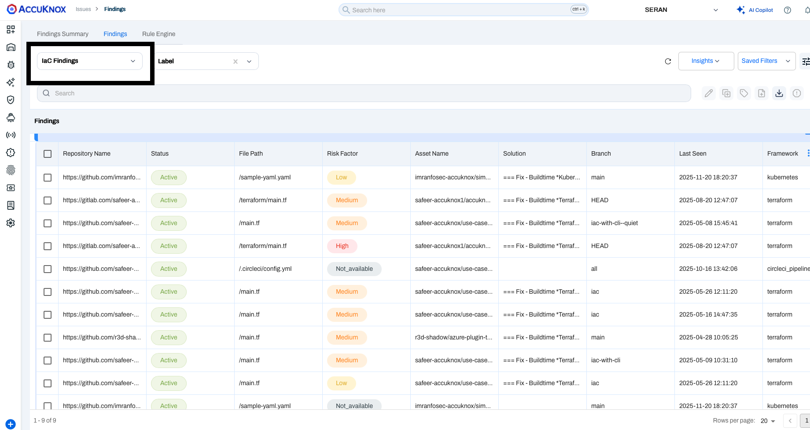
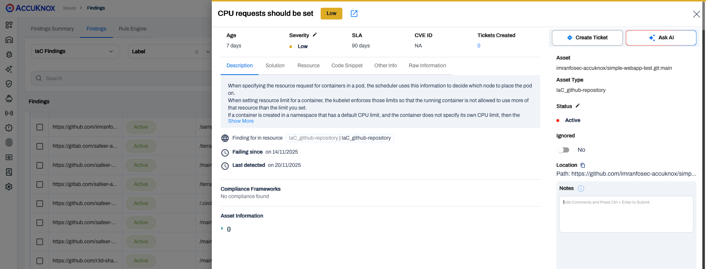

# Bamboo CI IaC Scan Integration
Integrate AccuKnox IaC scanning with Bamboo CI to automatically detect and remediate misconfigurations in Terraform, CloudFormation, or Kubernetes templates before deployment.

## Prerequisites

!!! abstract "Before you begin"
    Ensure you have the following prerequisites ready before starting the integration:

    1. **Bamboo Access** - Permission to create and configure build plans, and manage global variables.
        - *Reference:* [Getting started with Bamboo | Bamboo Data Center 12.0](https://confluence.atlassian.com/bamboo/getting-started-with-bamboo-289277283.html)

    2. **AccuKnox UI Access** - Access to the AccuKnox platform.

    3. **AccuKnox Scan API Credentials** - You will need the following details:
        - Authentication Token - [How to Create Token](https://help.accuknox.com/how-to/how-to-create-tokens/)
        - Labels - [How to Create Labels](https://help.accuknox.com/how-to/how-to-create-labels/)
        - Endpoint URL

    4. **Repository Access** - Ensure Bamboo can perform a **full clone** of your source code repository during the build process.
        - *Reference:* [GitHub | Bamboo Data Center 10.2](https://confluence.atlassian.com/bamboo1020/github-1540728277.html)

    5. **Global Variables** - Defined global variables for endpoint, token, label, and softfail (including additional variables as required).
        - *Reference:* [Defining global variables | Bamboo Data Center 12.0](https://confluence.atlassian.com/bamboo/configuring-source-code-checkout-task-289277112.html)


## Configuration Steps

### Step 1: Define Global Variables

Navigate to **Bamboo Administration → Global Variables** and add the following:

| Variable Name | Description | Example |
| :--- | :--- | :--- |
| `ACCUKNOX_ENDPOINT` | URL of the AccuKnox CSPM panel | `cspm.demo.accuknox.com` |
| `ACCUKNOX_TOKEN` | Authentication token for AccuKnox API | `your_api_token_here` |
| `ACCUKNOX_LABEL` | Label to tag scan results | `bamboo-iac` |
| `SOFT_FAIL` | Optional flag to allow pipeline continuation on failure | `true` |

### Step 2: Add an IaC Scan Stage to Your Build Pipeline

In your Bamboo build plan, add a new **Script Task**. You can use the shell script below or the YAML configuration.

=== "Shell Script"

    ```bash title="Script Task"
    #!/bin/sh -e
    export SOFT_FAIL="true"
    export ACCUKNOX_ENDPOINT="${bamboo.ACCUKNOX_ENDPOINT}"
    export ACCUKNOX_TOKEN="${bamboo.ACCUKNOX_TOKEN}"
    export ACCUKNOX_LABEL="${bamboo.ACCUKNOX_LABEL}"

    # ASPM Scanner Installation
    wget -q https://github.com/accuknox/aspm-scanner-cli/releases/download/v0.13.8/accuknox-aspm-scanner -O accuknox-aspm-scanner
    chmod +x accuknox-aspm-scanner

    DIRECTORY="."
    FILE=""
    COMPACT="true"
    QUIET="true"
    FRAMEWORK="terraform"  # set appropriate IaC type

    if [ "${SOFT_FAIL}" = "true" ]; then
        softFailArg="--softfail"
    else
        softFailArg=""
    fi

    IAC_ARGS=""
    [ -n "$DIRECTORY" ] && IAC_ARGS="$IAC_ARGS --directory $DIRECTORY"
    [ -n "$FILE" ] && IAC_ARGS="$IAC_ARGS --file $FILE"
    [ "$COMPACT" = "true" ] && IAC_ARGS="$IAC_ARGS --compact"
    [ "$QUIET" = "true" ] && IAC_ARGS="$IAC_ARGS --quiet"
    [ -n "$FRAMEWORK" ] && IAC_ARGS="$IAC_ARGS --framework $FRAMEWORK"

    # Initiating IaC Scan
    fullCmd="accuknox-aspm-scanner scan $softFailArg iac --command \"$IAC_ARGS\" --container-mode"
    echo "Running: $fullCmd"
    sh -c "$fullCmd"
    ```

=== "YAML Configuration"

    ```yaml title="bamboo-specs.yaml"
    - script:
        interpreter: SHELL
        scripts:
          - |-
            #!/bin/sh -e
            export SOFT_FAIL="true"
            export ACCUKNOX_ENDPOINT="${bamboo.ACCUKNOX_ENDPOINT}"
            export ACCUKNOX_TOKEN="${bamboo.ACCUKNOX_TOKEN}"
            export ACCUKNOX_LABEL="${bamboo.ACCUKNOX_LABEL}"

            # ASPM Scanner Installation
            wget -q https://github.com/accuknox/aspm-scanner-cli/releases/download/v0.13.8/accuknox-aspm-scanner -O accuknox-aspm-scanner
            chmod +x accuknox-aspm-scanner

            DIRECTORY="."
            FILE=""
            COMPACT="true"
            QUIET="true"
            FRAMEWORK="terraform"  # set appropriate IaC type

            if [ "${SOFT_FAIL}" = "true" ]; then
                softFailArg="--softfail"
            else
                softFailArg=""
            fi

            IAC_ARGS=""
            [ -n "$DIRECTORY" ] && IAC_ARGS="$IAC_ARGS --directory $DIRECTORY"
            [ -n "$FILE" ] && IAC_ARGS="$IAC_ARGS --file $FILE"
            [ "$COMPACT" = "true" ] && IAC_ARGS="$IAC_ARGS --compact"
            [ "$QUIET" = "true" ] && IAC_ARGS="$IAC_ARGS --quiet"
            [ -n "$FRAMEWORK" ] && IAC_ARGS="$IAC_ARGS --framework $FRAMEWORK"

            # Initiating IaC Scan
            fullCmd="accuknox-aspm-scanner scan $softFailArg iac --command \"$IAC_ARGS\" --container-mode"
            echo "Running: $fullCmd"
            sh -c "$fullCmd"
        description: IaC Scan Script
        artifact-subscriptions: []
    ```

!!! tip "Note"
    - Set `SOFT_FAIL=false` to enforce strict build blocking when misconfigurations are found.
    - Use `FRAMEWORK=terraform` or `FRAMEWORK=kubernetes` to narrow the scan scope.

---

## Workflow Comparison

!!! failure "Workflow Execution Without AccuKnox"
    Your IaC templates may deploy insecure configurations without centralized monitoring or enforcement.

!!! success "Workflow Execution With AccuKnox"
    Integrating AccuKnox IaC Scan with Bamboo CI ensures:

    - The scanner identifies IaC misconfigurations during Bamboo builds
    - Results are automatically uploaded to AccuKnox CSPM
    - Findings can trigger ticket creation and remediation workflows

---

## Viewing Results in AccuKnox

1. After the pipeline run, log in to **AccuKnox**.

2. Navigate to **AccuKnox → Issues → Findings**, and select **IaC Findings**.

    
    *IaC Findings Dashboard - Filtered by Label 'SPOC'*

3. Click any finding to view more details.

   

4. Use the **Create Ticket** button to raise a ticket directly from the finding.

!!! question "Need Help?"
    [Let us know](https://www.accuknox.com/contact-us/) if you need additional guidance in planning your cloud security program.
