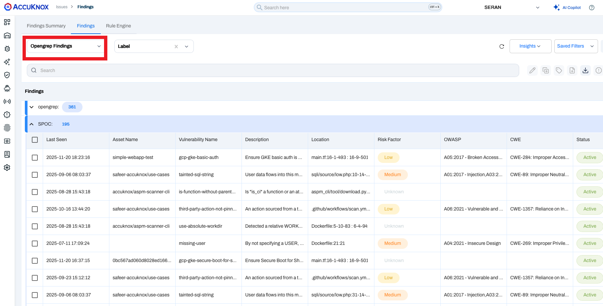
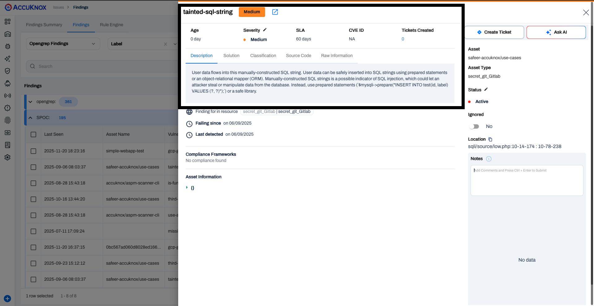

# SAST in Bamboo CI/CD (Static Application Security Testing)
Integrate AccuKnox SAST with Bamboo CI/CD to automatically detect and address code vulnerabilities before deployment, strengthening your application's security posture.

## Prerequisites

!!! abstract "Before you begin"
    Ensure you have the following prerequisites ready before starting the integration:

    1. **Bamboo Access** - Permission to create and configure build plans, and manage global variables.
        - *Reference:* [Getting started with Bamboo | Bamboo Data Center 12.0](https://confluence.atlassian.com/bamboo/getting-started-with-bamboo-289277283.html)

    2. **AccuKnox UI Access** - Access to the AccuKnox platform.

    3. **AccuKnox Scan API Credentials** - You will need the following details:
        - Authentication Token - [How to Create Token](https://help.accuknox.com/how-to/how-to-create-tokens/)
        - Labels - [How to Create Labels](https://help.accuknox.com/how-to/how-to-create-labels/)
        - Endpoint URL

    4. **Repository Access** - Ensure Bamboo can perform a **full clone** of your source code repository during the build process.
        - *Reference:* [GitHub | Bamboo Data Center 10.2](https://confluence.atlassian.com/bamboo1020/github-1540728277.html)

    5. **Global Variables** - Defined global variables for endpoint, token, label, and softfail (including additional variables as required).
        - *Reference:* [Defining global variables | Bamboo Data Center 12.0](https://confluence.atlassian.com/bamboo/configuring-source-code-checkout-task-289277112.html)

---

## Configuration Steps

### Step 1: Define Global Variables

Navigate to **Bamboo Administration → Global Variables** and add the following:

| Variable Name | Description | Example |
| :--- | :--- | :--- |
| `ACCUKNOX_ENDPOINT` | URL of the AccuKnox CSPM panel | `cspm.demo.accuknox.com` |
| `ACCUKNOX_TOKEN` | Authentication token for AccuKnox API | `your_api_token_here` |
| `ACCUKNOX_LABEL` | Label to tag scan results | `bamboo-sast` |
| `SOFT_FAIL` | Optional flag to allow pipeline continuation on failure | `true` |

### Step 2: Add a SAST Scan Stage to Your Build Pipeline

In your Bamboo build plan, add a new **Script Task**. You can use the shell script below or the YAML configuration.

=== "Shell Script"

    ```bash title="Script Task"
    #!/bin/sh -e
    export SOFT_FAIL="true"
    export ACCUKNOX_ENDPOINT="${bamboo.ACCUKNOX_ENDPOINT}"
    export ACCUKNOX_TOKEN="${bamboo.ACCUKNOX_TOKEN}"
    export ACCUKNOX_LABEL="${bamboo.ACCUKNOX_LABEL}"

    # ASPM Scanner Installation
    wget -q https://github.com/accuknox/aspm-scanner-cli/releases/download/v0.13.8/accuknox-aspm-scanner -O accuknox-aspm-scanner
    chmod +x accuknox-aspm-scanner

    # Determine soft-fail arg
    if [ "${SOFT_FAIL}" = "true" ]; then
        softFailArg="--softfail"
    else
        softFailArg=""
    fi

    # Initiating SAST Scan
    command='scan .' #replace . with directory path if required
    fullCmd="accuknox-aspm-scanner scan ${softFailArg} sast --command \"${command}\" --container-mode"
    echo "Running: $fullCmd"
    sh -c "$fullCmd"
    ```

=== "YAML Configuration"

    ```yaml title="bamboo-specs.yaml"
    - script:
        interpreter: SHELL
        scripts:
          - |-
            #!/bin/sh -e
            export SOFT_FAIL="true"
            export ACCUKNOX_ENDPOINT="${bamboo.ACCUKNOX_ENDPOINT}"
            export ACCUKNOX_TOKEN="${bamboo.ACCUKNOX_TOKEN}"
            export ACCUKNOX_LABEL="${bamboo.ACCUKNOX_LABEL}"

            wget -q https://github.com/accuknox/aspm-scanner-cli/releases/download/v0.13.8/accuknox-aspm-scanner -O accuknox-aspm-scanner
            chmod +x accuknox-aspm-scanner

            # Determine soft-fail arg
            if [ "${SOFT_FAIL}" = "true" ]; then
                softFailArg="--softfail"
            else
                softFailArg=""
            fi

            # Initiating SAST Scan
            command='scan .'
            fullCmd="accuknox-aspm-scanner scan ${softFailArg} sast --command \"${command}\" --container-mode"
            echo "Running: $fullCmd"
            sh -c "$fullCmd"
        description: aspm-cli-sast
        artifact-subscriptions: []
    ```

!!! tip "Note on Soft Fail"
    - The `SOFT_FAIL` option allows non-blocking scans so your build passes even if vulnerabilities are found.
    - For strict enforcement, set `SOFT_FAIL` to `false`.
    - Scan results are automatically uploaded to the AccuKnox CSPM dashboard, enabling centralized analysis, correlation with policies, and automated remediation workflows.

## Workflow Comparison

!!! failure "Workflow Execution Without AccuKnox"
    Your Bamboo build may perform static application security checks, but results remain local and require manual review. This might result in an aggravated myopic view of the security landscape of applications deployed.

!!! success "Workflow Execution With AccuKnox"
    Integrating AccuKnox SAST with Bamboo CI ensures:

    - Automated vulnerability detection in source code
    - Centralized visibility of findings in AccuKnox CSPM
    - Policy-based remediation tracking and compliance mapping


## Viewing Results in AccuKnox

1. After the pipeline run, log in to **AccuKnox**.

2. Navigate to **AccuKnox → Issues → Findings**, and select **OpenGrep Findings**.

    

    *SAST OpenGrep findings dashboard - Filtered by Label 'SPOC'*

3. Click any finding to view more details.

    

4. Use the **Create Ticket** button to raise a ticket directly from the finding.

!!! question "Need Help?"
    [Let us know](https://www.accuknox.com/contact-us/) if you are seeking additional guidance in planning your cloud security program.
