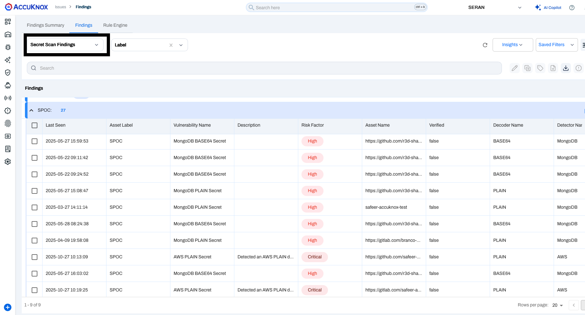
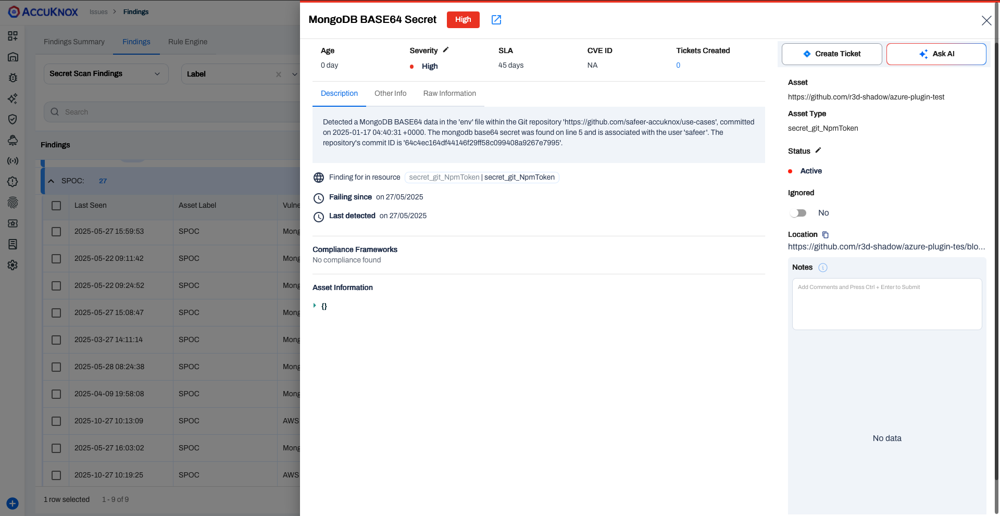

# Bamboo CI Secret Scan

This document describes the process of integrating AccuKnox Secret Scan into your Atlassian Bamboo CI/CD pipeline to automatically detect hard-coded secrets, API keys, tokens, and other sensitive data in your codebase.

## Prerequisites

!!! abstract "Before you begin"
    Ensure you have the following prerequisites ready before starting the integration:

    1. **Bamboo Access** - Permission to create and configure build plans, and manage global variables.
        - *Reference:* [Getting started with Bamboo | Bamboo Data Center 12.0](https://confluence.atlassian.com/bamboo/getting-started-with-bamboo-289277283.html)

    2. **AccuKnox UI Access** - Access to the AccuKnox platform.

    3. **AccuKnox Scan API Credentials** - You will need the following details:
        - Authentication Token - [How to Create Token](https://help.accuknox.com/how-to/how-to-create-tokens/)
        - Labels - [How to Create Labels](https://help.accuknox.com/how-to/how-to-create-labels/)
        - Endpoint URL


    4. **Repository Access** - Ensure Bamboo can perform a **full clone** of your source code repository during the build process.
        - *Reference:* [GitHub | Bamboo Data Center 10.2](https://confluence.atlassian.com/bamboo1020/github-1540728277.html)

    5. **Global Variables** - Defined global variables for endpoint, token, label, and softfail (including additional variables as required).
        - *Reference:* [Defining global variables | Bamboo Data Center 12.0](https://confluence.atlassian.com/bamboo/configuring-source-code-checkout-task-289277112.html)


## Configuration Steps

### Step 1: Define Global Variables

Navigate to **Bamboo Administration → Global Variables** and add the following:

| Variable Name | Description | Example |
| :--- | :--- | :--- |
| `ACCUKNOX_ENDPOINT` | URL of the AccuKnox CSPM panel | `cspm.demo.accuknox.com` |
| `ACCUKNOX_TOKEN` | Authentication token for AccuKnox API | `your_api_token_here` |
| `ACCUKNOX_LABEL` | Label to tag scan results | `bamboo-secret` |
| `SOFT_FAIL` | Optional flag to allow pipeline continuation on failure | `true` |

### Step 2: Add a Secrets Scan Stage to Your Build Pipeline

Add a Script stage to your existing pipeline. It installs the AccuKnox ASPM scanner and runs the secret scan on the checked-out repository.

=== "Shell Script"

    ```bash title="Script Task"
    #!/bin/sh -e
    export SOFT_FAIL="true"
    export ACCUKNOX_ENDPOINT="${bamboo.ACCUKNOX_ENDPOINT}"
    export ACCUKNOX_TOKEN="${bamboo.ACCUKNOX_TOKEN}"
    export ACCUKNOX_LABEL="${bamboo.ACCUKNOX_LABEL}"
    export DISABLE_SPINNER="TRUE"
    export RESULTS=""
    export BRANCH="all"
    export EXCLUDE_PATHS=""

    # ASPM Scanner Installation
    wget -q https://github.com/accuknox/aspm-scanner-cli/releases/download/v0.13.8/accuknox-aspm-scanner
    chmod +x accuknox-aspm-scanner

    if [ "${SOFT_FAIL}" = "true" ]; then
        softFailArg="--softfail"
    else
        softFailArg=""
    fi

    # Setting Arguments
    command="git file://."
    args=""
    [ -n "${RESULTS}" ] && args="${args} --results ${RESULTS}"
    [ -n "${BRANCH}" ] && args="${args} --branch ${BRANCH}"
    [ -n "${EXCLUDE_PATHS}" ] && args="${args} --exclude-paths '${EXCLUDE_PATHS}'"

    # Initiating Secret Scan
    fullCmd="accuknox-aspm-scanner scan ${softFailArg} secret --command \"${command}${args}\" --container-mode"
    echo "Running: $fullCmd"
    sh -c "$fullCmd"
    ```

=== "YAML Configuration"

    ```yaml title="bamboo-specs.yaml"
    - script:
        interpreter: SHELL
        scripts:
          - |-
            #!/bin/sh -e
            export SOFT_FAIL="true"
            export ACCUKNOX_ENDPOINT="${bamboo.ACCUKNOX_ENDPOINT}"
            export ACCUKNOX_TOKEN="${bamboo.ACCUKNOX_TOKEN}"
            export ACCUKNOX_LABEL="${bamboo.ACCUKNOX_LABEL}"
            export DISABLE_SPINNER="TRUE"
            export RESULTS=""
            export BRANCH="all"
            export EXCLUDE_PATHS=""

            # ASPM Scanner Installation
            wget -q https://github.com/accuknox/aspm-scanner-cli/releases/download/v0.13.8/accuknox-aspm-scanner
            chmod +x accuknox-aspm-scanner

            if [ "${SOFT_FAIL}" = "true" ]; then
                softFailArg="--softfail"
            else
                softFailArg=""
            fi

            # Setting Arguments
            command="git file://."
            args=""
            [ -n "${RESULTS}" ] && args="${args} --results ${RESULTS}"
            [ -n "${BRANCH}" ] && args="${args} --branch ${BRANCH}"
            [ -n "${EXCLUDE_PATHS}" ] && args="${args} --exclude-paths '${EXCLUDE_PATHS}'"

            # Initiating Secrets Scan
            fullCmd="accuknox-aspm-scanner scan ${softFailArg} secret --command \"${command}${args}\" --container-mode"
            echo "Running: $fullCmd"
            sh -c "$fullCmd"
        description: Secret Scan - ASPM CLI
        artifact-subscriptions: []
    ```

!!! tip "Note"
    - Set `SOFT_FAIL=false` to enforce strict build blocking when secrets are found.
    - `git file://.` instructs the scanner to scan the current Git working tree — adjust if you want to pass a specific path or tarball.

---

## Workflow Comparison

!!! failure "Workflow Execution Without AccuKnox"
    Without AccuKnox integration, secret scans might be run locally or manually; however, findings are not centrally collected.

!!! success "Workflow Execution With AccuKnox"
    With AccuKnox integration, scan outputs are automatically forwarded to AccuKnox for:

    - Risk scoring and enrichment
    - Remediation workflows (ticket creation, SLA tracking, etc.)
    - Centralized visibility across all pipelines

---

## Viewing Results in AccuKnox

1. After the pipeline run, log in to **AccuKnox**.

2. To see all of your Secret Scan findings, navigate to: **AccuKnox → Issues → Findings → Secret Scan Findings**

    

    *Secret Scan Findings Dashboard - Filtered by Label 'SPOC'*

3. Click on any finding to get more details. You can also click on **Create Ticket** to generate a ticket.

    

!!! question "Need Help?"
    [Let us know](https://www.accuknox.com/contact-us/) if you are seeking additional guidance in planning your cloud security program.
