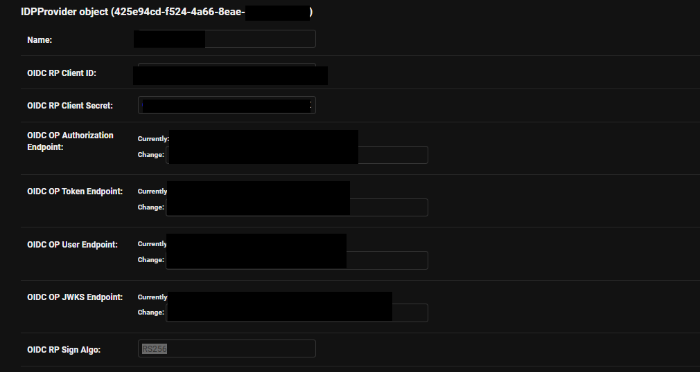

# Okta SSO with AccuKnox

This guide helps you integrate **Okta** with **AccuKnox** using **OpenID Connect (OIDC)** for Single Sign-On (SSO).

## Prerequisites

- Auth0 account with admin access.
- Access to AccuKnox Tenant for user invitation

## 1. Create Okta Application Integration

1. Sign in to your [**Auth0 Dashboard**](https://manage.auth0.com/dashboard/).
2. Navigate to **Applications > Applications**.

1. Click **Default Application**.
2. **App Integration Settings**:
    - **App integration name**: Any meaningful name (e.g., `AccuKnox SSO`).
    - **Sign-in redirect URIs**:
      Enter: `https://cspm.accuknox.com/oidc/callback/`

1. Leave the other settings including Cross-Origin Authentication as on.
2. Click **Save**.

## 2. Gather Required Information

Once the application is created, you will be redirected to the application's **General** tab. You need to collect specific details to complete the setup with AccuKnox.

- Copy the **Domain**.
- Copy the **Client ID**.
- Copy the **Client Secret**.

!!! info "Provide Details to AccuKnox"
    === "SaaS Users"
        - Share the **Client ID**, **Client Secret**, and **Okta Domain** securely with the AccuKnox support team.
        - The team will configure the OIDC backend for your organization.

    === "On-Premise Users"
        - You can directly input the configuration into your admin portal: [IDP Providers Configuration Page](https://cspm.accuknox.com/admin/accuknox_oidc_client/idpprovider/)
        - Here is a sample configuration using your Okta details:
        

## 3. Invite Okta Users to AccuKnox

1. Log in to the **AccuKnox SaaS console**.
2. Go to **User Management > Invite User**.
3. Enter the **email address** of the user along with other details and send the invite.

!!! info "Note"
    Ensure the invited Okta user has their **email field filled in** within their Okta profile. The email must **exactly match** the one used during the AccuKnox invitation.

## 4. Logging in to AccuKnox via Okta SSO

1. Navigate to the [AccuKnox Login Page](https://cspm.demo.accuknox.com/).
2. Click **OpenID**.
3. Enter your **organization name**.

4. You will be redirected to Okta. Sign in using your **Okta credentials**.
5. Upon successful authentication, you will be logged into the AccuKnox dashboard.

