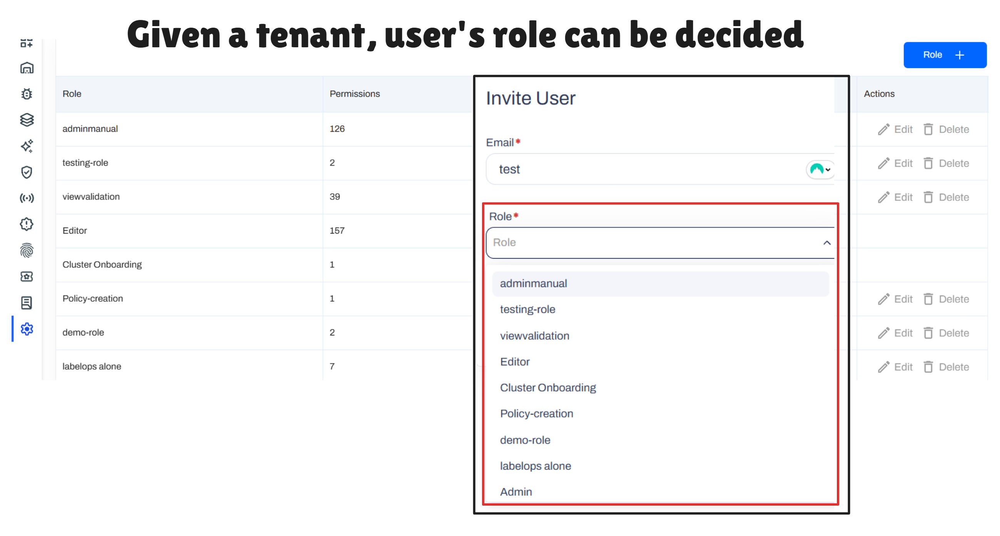
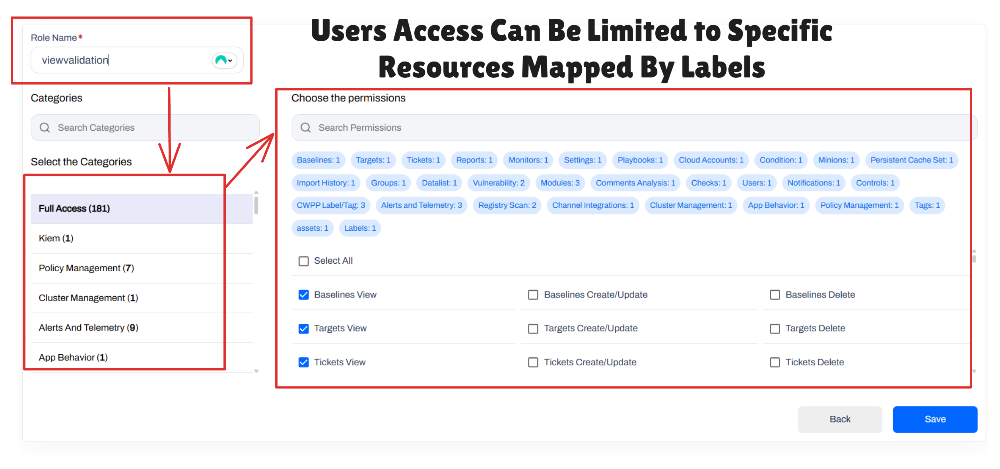
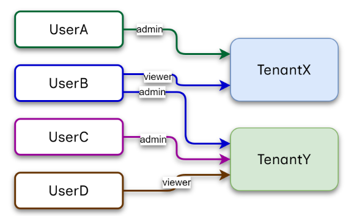
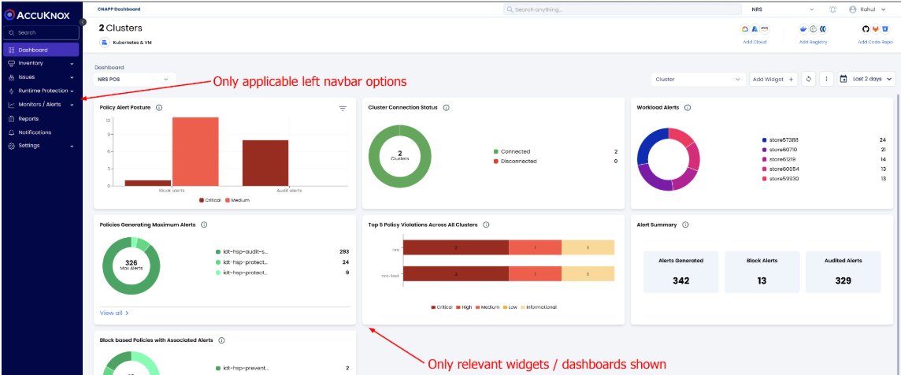

# Multi-Tenancy & Scalability Architecture

!!! info "Overview"
    AccuKnox is architected to serve multiple customers or tenants from a single infrastructure while ensuring rigorous security, high performance, and cost-effectiveness. Our platform supports scaling to thousands of tenants and managing massive workloads without compromising isolation or user experience.

## The Multi-Tenancy Approach

Building a robust multi-tenant solution requires handling isolation at multiple levels. AccuKnox adopts a **Layered Multi-Tenancy** approach to ensure that security, data integrity, and resource fairness are maintained across the entire stack.

The architecture addresses multi-tenancy across four distinct layers:

1. **User Management & RBAC** (Access Control)
2. **Execution Pipelines** (Compute & Jobs)
3. **Data Storage** (Database & Logs)
4. **User Experience** (Custom Views & Reporting)

## Isolation Models: Hard vs. Soft

AccuKnox supports a **Hybrid Model**, allowing flexibility based on customer requirements (e.g., BFSI customers requiring strict physical separation vs. SME customers prioritizing cost-efficiency).

| Feature | Hard Isolation | Soft Isolation |
| : | : | : |
| **Description** | Dedicated infrastructure (App & DB instances) per customer. | Shared infrastructure and DB, with logical separation (e.g., Namespaces, Separate Tables). |
| **Pros** | Maximum security isolation; Guaranteed resources. | Cost-effective; Easy to maintain; High resource utilization. |
| **Cons** | High operational cost and complexity. | Requires robust software-level controls (which AccuKnox provides). |
| **AccuKnox Strategy** | Supported for specific Enterprise/OEM needs. | **Default standard** for scalability, utilizing K8s native constructs. |

## Layer 1: Users, RBAC, and Tenant Management

The first layer of isolation manages how users access the platform. AccuKnox solves complex hierarchy problems out-of-the-box.

!!! example "Use Case: MSSP Operations"
    An MSSP administrator can manage hundreds of customer tenants from a single pane of glass, switching contexts seamlessly while maintaining strict permission boundaries between customer data.

### Cross-Tenant & Cross-Group Access

* **One User, Multiple Tenants:** A single user (e.g., an MSSP Admin or a CISO) can be part of multiple tenants. Permissions are context-aware, meaning a user can be an `Admin` in *Tenant A* but only a `Viewer` in *Tenant B*.
* **Granular RBAC:** Access can be restricted not just by tenant, but by specific resource groups (e.g., "DevOps Team" only sees assets related to their specific repo).

!!! info "FAQ"
    Q: Can MSSP users access end customer tenant accounts?
    A: Yes. AccuKnox fully supports MSSP users having viewer/editor access to end customer tenants, with customer permission. This is a critical requirement for MSSP models, and our platform is designed to accommodate it securely and seamlessly.

## Layer 2: Compute Isolation & Job Execution

This layer handles the heavy lifting—scanning, playbook execution, and backend jobs. The primary challenge here is the **"Noisy Neighbor"** problem, where one tenant hogs resources (CPU/Memory), starving others.

### Solving the Noisy Neighbor Problem

AccuKnox leverages **Kubernetes Native Solutions** to ensure fair resource allocation:

* **Namespaces:** Each tenant operates in its own K8s namespace.
* **Resource Quotas:** CPU and Memory limits are enforced per tenant.
* **Kueue (Job Queuing):** We utilize `Kueue` for advanced job scheduling. It ensures:
    * **Fair Sharing:** Tenants have a guaranteed quota. If a tenant isn't using their quota, idle resources can be temporarily borrowed by others to speed up execution.
    * **Priority Handling:** Ad-hoc scans triggered by a user via the UI take priority over scheduled background jobs.

!!! success "Use Case: High Scale Scanning"
    For a customer scaling from **100 vCPUs to 25,000 vCPUs** to scan 100K+ container images, AccuKnox's architecture ensured that massive scan jobs did not overwhelm the cluster. If resources were idle, the tenant could burst usage to finish faster, but never at the expense of other tenants' stability.

## Layer 3: Data Isolation

To reduce the "Blast Radius" and ensure data privacy, AccuKnox implements strict storage isolation without the overhead of managing thousands of database instances.

* **PostgreSQL:** We use **separate tables** for each tenant within the same DB instance.
* **MongoDB:** We use **separate collections** for each tenant.
* **Access Control:** Every table and collection has its own unique access control mechanisms.

This approach ensures that even if a logical breach were to occur (hypothetically), a compromised tenant cannot access the data tables of another tenant.

## Layer 4: Custom User Experience (UX)

Not every tenant needs every feature. For example, a customer using AccuKnox solely for **Runtime Security** should not be cluttered with UI elements for **Compliance** or **Image Scanning**.

* **Feature Flags:** AccuKnox uses tools like **GrowthBook** to enable/disable features on a per-tenant basis.
* **Dynamic UI:** The Left Navigation Bar and Dashboard widgets dynamically render based on the active services for that specific tenant.

!!! example "Use Case: Runtime Security Only"
    For a customer utilizing AccuKnox exclusively for Runtime Security, the dashboard is stripped of all non-relevant widgets, and the navigation bar is streamlined, providing a clean, purpose-built experience.

## Benefits & Deployment Flexibility

AccuKnox's multi-tenancy architecture is consistent across **SaaS**, **On-Premises**, and **Air-Gapped** deployments, offering significant advantages:

* **Scalability:** Proven to scale to **5,000+ customers**.
* **Efficiency:** Optimizes infrastructure costs via `Kueue` and soft isolation.
* **Security:** Minimizes blast radius through strict RBAC, Namespaces, and Data separation.
* **Flexibility:** Supports MSSP models and custom UI experiences across all deployment types.

> *For more technical details on setting up tenants or configuring quotas, please refer to the [Admin Guide](https://help.accuknox.com/how-to/administrators-guide/).*