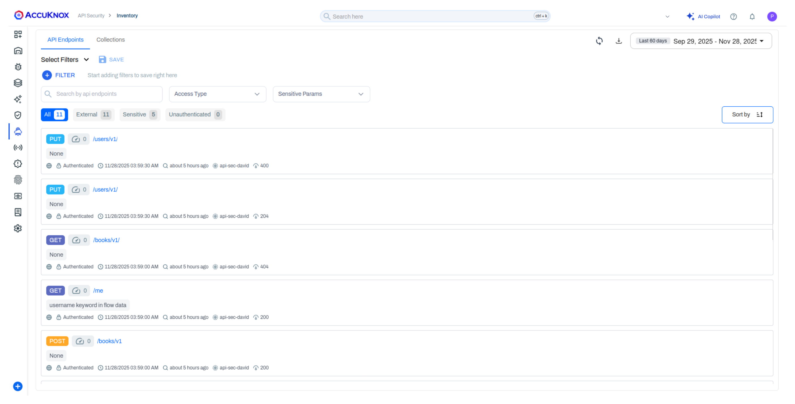
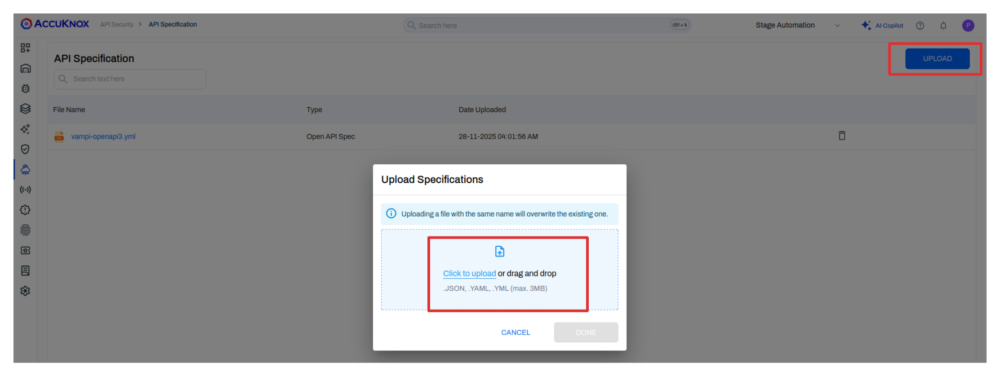

# API Security Use Case

## 1. Prerequisites

Ensure you have completed the integration of your API environment with AccuKnox API Security. Refer to the relevant integration guide for your platform (e.g., AWS API Gateway, Kubernetes API Proxy, Istio, Nginx Ingress).

!!! tip "Integration Guides"
    [**API Security Integrations**](../integrations/api-overview.md) provides detailed instructions for various platforms.

## 2. Real-Time API Inventory in AccuKnox Control Plane

As soon as logs reach the control plane:

- API endpoints appear in the **Inventory** tab.
- Inventory shows method, path, request and response bodies, and sensitive-data classification.
- External and internal calls are labeled accordingly.

Inventory updates continuously as logs arrive.

!!! info "Auto-Creation of Collections"
    A collection is automatically created based on the **Host endpoint** once the API agent receives logs. This provides immediate organization of your API endpoints without manual intervention.

## 3. Create API Collections

While collections are automatically created based on host endpoints, you can also create custom collections to better organize your API inventory.

1. Go to **API Security → Collections**.
2. Click **Create Collection**.
3. Define filters using the following options:
    - **Host**: Filter by specific host/domain
    - **Name**: Filter by endpoint name
    - **Regex**: Use regular expressions for pattern matching
    - **Method**: Select from dropdown options (GET, POST, PUT, DELETE, PATCH, etc.)
4. Save your collection.

Collections help organize endpoints before scanning and provide logical groupings for security analysis.

## 4. Upload Your OpenAPI Specification

API Specifications (OpenAPI/Swagger format) can be uploaded to define the expected API structure for comparison during scans.

### Method 1: Via Inventory Page

1. Navigate to **API Security → Inventory**.
2. Click on the upload option.
3. Select your OpenAPI specification file (YAML or JSON).
4. Upload the file.

### Method 2: During Scan Configuration

1. Navigate to **API Security → Scans → New Scan**.
2. During the scan setup, you'll have the option to upload your specification.
3. Select your OpenAPI specification file (YAML or JSON).
4. Upload the file.

!!! info "Use Case"
    The API specification is essential for scan comparisons. It serves as the baseline to identify **Shadow APIs (undocumented endpoints), Orphan APIs (documented but unused), and validate Active APIs** against your intended design.

## 5. Scan API Endpoints

1. Go to **API Security → Scans → New Scan**.
2. Select the OpenAPI spec you uploaded.
3. Choose the inventory or a collection.
4. Run the scan.

The scan compares runtime traffic with your specification.

## 6. Review Findings

AccuKnox displays four types of findings:

| Finding Type   | Description                                                                                   |
|----------------|-----------------------------------------------------------------------------------------------|
| Zombie APIs    | Detected endpoints that are no longer active but still exist in the spec.                     |
| Shadow APIs    | Endpoints seen in runtime traffic but not present in the spec.                                |
| Orphan APIs    | Endpoints defined in the spec but never seen in traffic.                                      |
| Active APIs    | Endpoints currently receiving traffic.                                                        |

Each finding includes request, response, and occurrence details.

