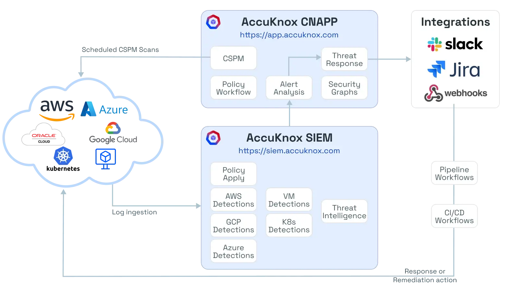
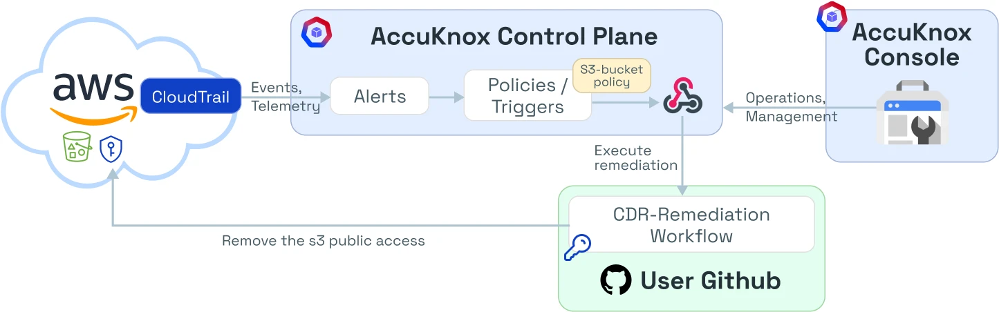
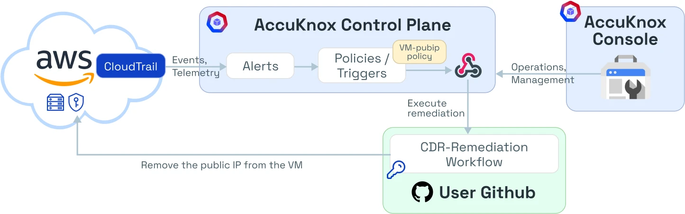
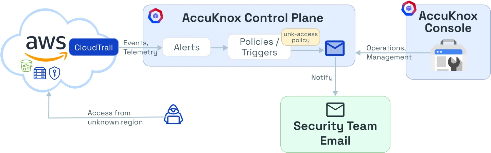
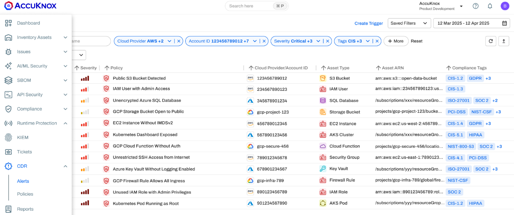

# Cloud Detection & Response (CDR)

!!! tip "Quick Links"
    - **Onboarding:** [CDR Onboarding for AWS, GCP & Azure](https://help.accuknox.com/getting-started/aws-cdr/)
    - **Remediation Setup:** [CDR Remediation Steps](https://help.accuknox.com/getting-started/cdr-setup/)

## The Problem

Cloud infrastructure is dynamic. Despite rigorous provisioning checks, assets often drift from their secure state due to manual changes or misconfigurations during runtime. Common critical risks include:

- Storage buckets (e.g., S3, GCS) accidentally exposed to the public
- Virtual Machines (VMs) launched with public IPs or unsecured ports
- Access requests originating from unauthorized or unknown geographic regions

!!! warning "Manual Monitoring is Insufficient"
    Manual monitoring is insufficient for these real-time threats. You need automated detection and response.

## The Solution

**AccuKnox CDR** provides an automated, closed-loop security system. It ingests cloud logs (CloudTrail, Audit Logs), detects policy violations in real-time, and triggers immediate automated remediation workflows (via CI/CD or Webhooks) to revert the infrastructure to a secure state.

### High-Level Architecture

The solution operates on an event-driven architecture connecting your Cloud Environment, the AccuKnox SIEM/CNAPP Control Plane, and your Remediation Pipelines.

!!! info "Architecture Overview"
    The architecture captures cloud events, analyzes them against security policies, and triggers remediation actions.
    

## Integration Workflow

| Stage                | Description                                                                                   | Example/Method                |
|----------------------|----------------------------------------------------------------------------------------------|-------------------------------|
| **Ingest & Detect**  | Capture cloud events (CloudTrail, Audit Logs) and analyze for policy violations              | `PutBucketPublicAccessBlock`  |
| **Alert Trigger**    | Generate alert, check for response policy, notify via Slack/Jira/Email                       | Dashboard alert, notification |
| **Automated Response** | Invoke remediation workflow via webhook or CI/CD pipeline                                   | GitHub Actions, Jenkins       |
| **Remediation & Verification** | Execute fix (e.g., remove public IP), update dashboard status                        | Remediation script, status    |

## Primary Use Cases

Below are the three standard implementation scenarios for CDR.

### Enforcing Private S3 Buckets

!!! example "Goal"
    Automatically revoke public access if a user inadvertently exposes an S3 bucket.

1. **Trigger Event:** A user performs an action that enables public access on a bucket
2. **Detection:** CloudTrail logs the API event. AccuKnox detects a violation of the `Public S3 Bucket Detected` policy
3. **Action:** The system triggers the **CDR-Remediation Workflow**
4. **Remediation:** The workflow executes `remove-bucket-public-access`, reverting the bucket permissions to private

### Restricting Public IPs on VMs

!!! example "Goal"
    Ensure no Compute Engine/EC2 instance is reachable via a public IP address.

1. **Trigger Event:** A VM is launched or modified to have a Public IP
2. **Detection:** The system flags the `VM-pubip policy` violation
3. **Action:** The **CDR-Remediation Workflow** is invoked
4. **Remediation:** The workflow executes the `remove-public-ip` action, detaching the public network interface while keeping the instance running

### Geo-Fencing Access

!!! example "Goal"
    Detect and notify if cloud resources are accessed from an unapproved region.

1. **Trigger Event:** API access detected from a region not on the allow-list
2. **Detection:** The `unk-access policy` is triggered
3. **Action:** Unlike remediation, this triggers a **Notification Workflow**
4. **Outcome:** The Security Team receives an immediate high-priority email/Slack alert to investigate potential credential compromise

## Prerequisites for Remediation

To enable the "Response" component of CDR, ensure your remediation pipeline (CI/CD) has the necessary permissions.

??? note "Required Cloud Permissions (Expand for Details)"

    ### AWS Permissions

    | Action | Required Permissions | Policy Name |
    | :--- | :--- | :--- |
    | **Make S3 Private** | `s3:PutBucketPublicAccessBlock`, `s3:ListBucket` | `s3_make_bucket_private.yaml` |
    | **Shutdown EC2** | `ec2:TerminateInstances`, `ec2:DescribeInstances` | `ec2_shutdown_public_instance.yaml` |
    | **Enable CloudTrail** | `cloudtrail:StartLogging` | `cloudtrail_ensure_enabled.yaml` |

    ### GCP Permissions

    | Action | Required Permissions | Policy Name |
    | :--- | :--- | :--- |
    | **Revert Firewall** | `compute.firewalls.update`, `compute.firewalls.get` | `revert_firewall_ports.yaml` |
    | **Shutdown Instance** | `compute.instances.delete` | `instance_delete_public_ip.yaml` |

    ### Azure Permissions

    | Action | Required Permissions | Policy Name |
    | :--- | :--- | :--- |
    | **Block Blob Public Access** | `Microsoft.Storage/.../write` | `storage_container_block_public_access.yaml` |
    | **Terminate Public VM** | `Microsoft.Compute/virtualMachines/delete` | `vm_terminate_public_ip.yaml` |

## Visualizing Alerts

Track the effectiveness of your policies in the **Alerts Dashboard**.

1. Navigate to **CDR → Alerts**
2. Filter by **Severity: Critical**
3. Locate the specific alert (e.g., "GCP Storage Bucket Open to Public")
4. Check the status to confirm if the **Auto-Remediation** action was successfully triggered and the issue is resolved.

